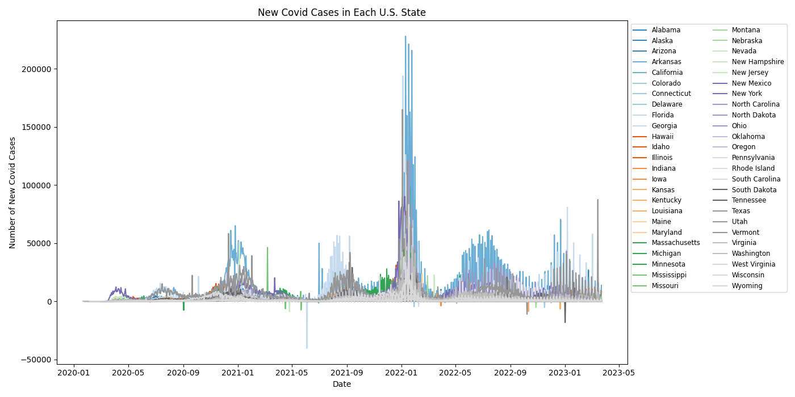
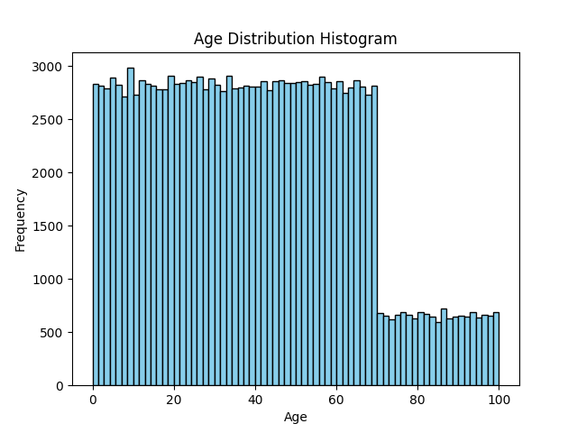
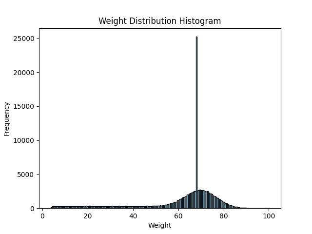
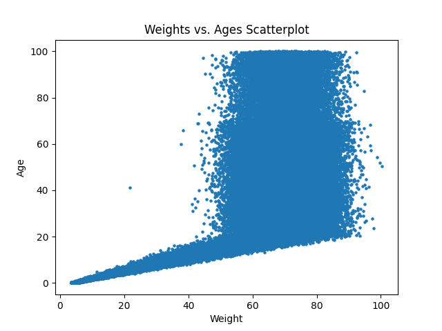
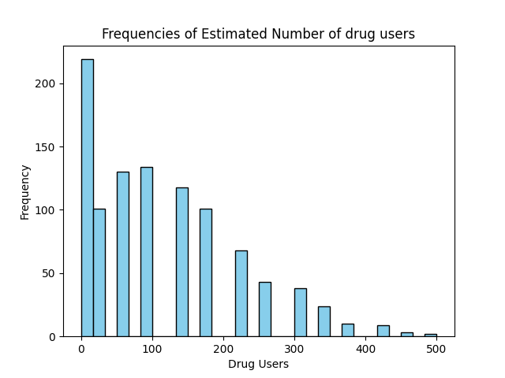
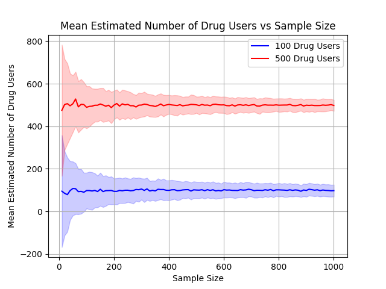

# Skills Demonstrated:
## Data acquisition and cleaning
Loading real-world, third-party data (NYT COVID-19 dataset) and converting cumulative counts into period-over-period deltas (Ex. 2), including recognizing and explaining anomalies in the raw data (negative case counts from data revisions) rather than silently working around them.
## Time-series analysis
Working with pandas Timestamp objects, computing peak dates via idxmax(), and calculating elapsed time between events using Timedelta arithmetic (Ex. 2).
## Relational data access
Querying a SQLite database directly into a pandas DataFrame with sqlite3 (Ex. 3), a common pattern when working with EHR or other structured backend data.
## Descriptive statistics & exploratory data analysis
Computing mean/std/min/max, choosing histogram bin counts using a justified method (Freedman-Diaconis rule), and visually identifying outliers via scatterplots (Ex. 3).
## Data visualization
Building multi-series line charts, histograms, and scatterplots with matplotlib (Ex. 2-4).
## Simulation & statistical inference
Implementing randomized response and recovering an unbiased population estimate from noisy individual responses (Ex. 4).

# Exercise 1:
## Instructions
Run the script and it should output the results of the test cases
## Q1b
The body temperature could have been interpreted in Fahrenheit rather than Celsius. The phrase "within 1 degree" can also be interpreted as either <1 or ≤1.

# Exercise 2:
## Instructions
Run the script, and first should appear a graph for Q2b. Once you close out of the graph, then the results for Q2c and Q2d will appear in the terminal. To change what states you would like to examine in Q2c and Q2d, you will need to go to the program and change the states there, with the function calls being located at the bottom.
## Q2a
Data for exercise obtained from The New York Times
## Q2b
As I was testing it out, I noticed that some of the lines went below 0, which shouldn't happen if we're only accounting for new cases. I looked at the csv, and noticed that, at least for Missouri, there's a day where it jumps by around 8k, but then drops down 7k the next day. I assume this is an issue with the data and that it was misreported, leading to a negative amount of new cases. I think one of the limitations in terms of my coding approach was that I could have put more stuff outside of the for loop so that I don't have to read through the original csv as many times as I did. I think there's also probably another way to display the data more clearly, but I'm not sure how to do that with the amount of states and dates given. The graph for Q2b is shown below:<br/>

## Q2c
I tested a couple of states, being Missouri and California. For Missouri, I ran the program and it returned 2021-03-08, and in the csv, that had approximately 45k new cases that day. Looking at the graphical representation from Q2b, the function seemed to provide the correct date for the number of peak cases. For California, the program returned 2022-01-10, which matched the date of the highest peak found in both the csv and the chart generated from Q2b.
## Q2d
I tested Missouri and California, which Missouri should result in having an earlier peak. When I ran the program, it returned that Missouri had an earlier peak, and by 308 days, which is the correct amount of time between the two peaks. Assuming Q2c works as it should, I also tested Illinois (which had a peak date of 2022-01-18) and California, and the program properly determined that California had its peak first, and that it happened 8 days before Illinois
## Q2e
To view the data for Florida, I temporarily changed the states list to only include Florida and checked for Florida's peaks as well. There are a couple unusual patterns in the data, namely the negative value in the number of new cases and the data near the end of 2022 and onwards. For the negative value, I hypothesize that there was a misreported value on the previous day, so that when the value was corrected, the program interprets it as a negative amount of new cases. As for the data near the end of 2022 and onwards, I hypothesize that the state of Florida had started to do infrequent reports on the number of new covid cases due to the fact that there are periods of no new cases and suddenly a day with a large amount of new cases.

# Exercise 3:
## Instructions
Run the script and the mean, std, min, and max should appear in terminal before the graph pops up (for both age and weight). Close the image to move onto the next graph, and there is also a scatterplot after the two histograms
## Q3a
By printing out the data, it showed that there were 4 columns, those being name, age, weight, and eyecolor in that order. It also showed that there were 152361 rows in the dataset
## Q3b
The mean age is 39.51052792739697<br/>
The standard deviation for age is 24.152760068601573<br/>
the minimum age is 0.0007476719217636152<br/>
the maximum age is 99.99154733076972<br/>
The role of the number of bins in a histogram is simplify data visualization while still retaining the integrity of the data. For this dataset, to determine the number of bins for the histogram, I used the Freedman-Diaconis Rule (calculations present in code), and it resulted in 70 bins. I initially had it at 30 bins before doing the calculation, and I don't think anything is really gained or lost when looking at the general trends in the data, so I decided to stick with the result from the Freedman-Diaconis Rule.<br/>
<br/>
Looking at the age distribution, I wouldn't say that there are any outliers, but there is a significant change at age 70 and higher, where the frequency is much lower than ages under 70. Both regions remain relatively consistent, it's just that there a large drop in frequency at 70 years of age.
## Q3c
The mean weight is 60.884134159929715<br/>
The standard deviation for weight is 18.41182426565962<br/>
The minimum weight is 3.3820836824389326<br/>
The maximum weight is 100.43579300336947<br/>
<br/>
There is a general trend of becoming more frequent in the middle regions and less frequent at the end regions. However, there is one significant outlier, and that is that there are a very large amount of people at approximately 68kg compared to any other weight
## Q3d
<br/>
The general relationship between weights and ages is that as one gains weight before 50kg, they are getting older. However, when the weight is over 50kg, the minimum weight increases with age, but besides that, there is little to no correlation between weight and age.<br/>
There is an individual named Anthony Freeman that does not follow the general relationship shown in the scatterplot. He is labeled as an outlier because he strays very far from the rest of the dataset, since most people at his age (41.3) would be at least 40 kg (he is 21.7kg), and his weight is more in line with individuals in their mid-teens.

# Exercise 4:
## Instructions
Run the script and the result for 4f will appear on screen. Other functions can be called by putting it at the end of the script, and the number of repetitions can be altered by using the appropriate function parameters.
## Q4a
I wanted to note that I'm not sure if we needed to randomize the order of True/False, but I decided to shuffle the list so as to not have it be d Trues in a row followed by remaining Falses
## Q4c
As a result of the variability introduced by the coin flip, there may be times where the fraction of drug users in the reported sample can be less than 0.25, which would result in a negative estimate. To handle this scenario, I added an if statement that would set the estimate to 0 if it ever had a negative value, essentially adding a boundary at 0.
## Q4d
When running a simulation with a population = 1,000, drug users = 100, and sample size = 50, the script reported that an estimated 140 people would be drug users
## Q4e
I ran the experiment 1,000 times. I chose this number because the data collected showed a nice bell curve, implying that there was enough data points to show a trend, and the test was very fast. I tested 10,000 to see if anything else would show up, but the same trend continued to persist, but at the cost of extra time.<br/>
<br/>
There is a very large amount of samples in the bin containing 0, and that is because the variability caused by the coin flips make it so that it's possible that there's a "negative" number of drug users, but since that doesn't make sense in application, the negative values were all changed to 0, leading to a large amount of estimates being 0. However, even with the variability. the top of the bell curve matches with the real amount of drug users, so the correct information can be obtained.
## 4Qf
<br/>
Before discussing the findings, I would like to mention that I had set the number of repetitions per sample size to be 250, since 1000 took a while and started to become taxing on my computer. I had also made a slightly altered estimate function that would include negatives because if I had removed the negative values, then my mean would be higher than it should be. <br/>
In the plot, the mean generally stayed around the true number of drug users, but had become more consistent when the sample size grew. The standard deviation, however, were extremely large in the at low sample sizes. As the sample sizes increased, the standard deviation size quickly reduced and eventually plateaued. These patterns indicate that if you only take one small sample, there is a much larger chance of it being incorrect than if you had taken a large sample. It also showed that taking a mean of many samples generally has a good accuracy that gets better as sample size increases.

# Appendix

## Exercise 1
```python
#function to take the normal temperature as the parameter
def temp_tester(normal_temp):
    #creates a tester for a species and compares the temperature of the subject
    def tester(temp_check):
        if(abs(normal_temp - temp_check) < 1):
            return True
        else:
            return False
    return tester

human_tester = temp_tester(37)
chicken_tester = temp_tester(41.1)

print(chicken_tester(42))
print(human_tester(42))
print(chicken_tester(43))
print(human_tester(35))
print(human_tester(98.6))
```
## Exercise 2
```python
import pandas as pd
import matplotlib.pyplot as plt
data = pd.read_csv("problem_set_0/us-states.csv")

# list of states
states = ['Alabama', 'Alaska', 'Arizona', 'Arkansas', 'California', 'Colorado', 'Connecticut', 'Delaware', 'Florida', 
          'Georgia', 'Hawaii', 'Idaho', 'Illinois', 'Indiana', 'Iowa', 'Kansas', 'Kentucky', 'Louisiana', 'Maine', 'Maryland', 
          'Massachusetts', 'Michigan', 'Minnesota', 'Mississippi', 'Missouri', 'Montana', 'Nebraska', 'Nevada', 'New Hampshire', 
          'New Jersey', 'New Mexico', 'New York', 'North Carolina', 'North Dakota', 'Ohio', 'Oklahoma', 'Oregon', 
          'Pennsylvania', 'Rhode Island', 'South Carolina', 'South Dakota', 'Tennessee', 'Texas', 'Utah', 'Vermont', 'Virginia', 
          'Washington', 'West Virginia', 'Wisconsin', 'Wyoming']

num_states = len(states)
colormap = plt.cm.get_cmap('tab20c', num_states)
state_colors = {state: colormap(i / num_states) for i, state in enumerate(states)}

def case_visualization(states):
    plt.figure(figsize=(14, 7))
    for state in states:
        state_data = data[data['state'] == state].copy()
        state_data['date'] = pd.to_datetime(state_data['date'])
        state_data['new_cases'] = state_data['cases'].diff().fillna(0).astype(int)
        plt.plot(state_data['date'], state_data['new_cases'], label=state, color = state_colors[state])
    plt.xlabel('Date')
    plt.ylabel('Number of New Covid Cases')
    plt.title('New Covid Cases in Each U.S. State')
    plt.legend(loc='upper left', bbox_to_anchor=(1, 1), fontsize='small', ncol = 2, frameon=True)
    plt.tight_layout()
    plt.show()

def peak_case_date(state):
    state_data = data[data['state'] == state].copy()
    state_data['new_cases'] = state_data['cases'].diff().fillna(0).astype(int)
    peak_date = state_data.loc[state_data['new_cases'].idxmax(), 'date']
    return peak_date

def comp_peaks(state1, state2):
    state1_peak = pd.to_datetime(peak_case_date(state1))
    state2_peak = pd.to_datetime(peak_case_date(state2))
    if(state1_peak < state2_peak):
        peak_diff = (state2_peak - state1_peak).days
        print(state1, "had its peak", peak_diff, "days before", state2)
    elif(state2_peak < state1_peak):
        peak_diff = (state1_peak - state2_peak).days
        print(state2, "had its peak", peak_diff, "days before", state1)
    else:
        print("Both states had their peak on the same day")

case_visualization(states)
print("Illinois had its peak number of new cases on", peak_case_date("Illinois"))
comp_peaks("California", "Illinois")
```
## Exercise 3
```python
import pandas as pd
import sqlite3
import matplotlib.pyplot as plt
import numpy as np

with sqlite3.connect("problem_set_0/hw0-population.db") as db:
    data = pd.read_sql_query("SELECT * FROM population", db)

print(data)

def age_distribution():
    age_mean = data['age'].mean()
    age_std = data['age'].std()
    age_min = data['age'].min()
    age_max = data['age'].max()
    print("The mean age is", age_mean)
    print("The standard deviation for age is", age_std)
    print("The minimum age is", age_min)
    print("The maximum age is", age_max)
    #calculations for number of bins
    q1 = data['age'].quantile(0.25)
    q3 = data['age'].quantile(0.75)
    iqr = q3 - q1
    num_bins = (age_max - age_min) / (2 * iqr / (data.shape[0] ** (1/3)))
    # print("The number of bins should be", num_bins)
    plt.hist(data['age'], bins=70, color='skyblue', edgecolor='black')
    plt.xlabel('Age')
    plt.ylabel('Frequency')
    plt.title('Age Distribution Histogram')
    plt.show()
    return None

def weight_distribution():
    weight_mean = data['weight'].mean()
    weight_std = data['weight'].std()
    weight_min = data['weight'].min()
    weight_max = data['weight'].max()
    print("The mean weight is", weight_mean)
    print("The standard deviation for weight is", weight_std)
    print("The minimum weight is", weight_min)
    print("The maximum weight is", weight_max)
    q1 = data['weight'].quantile(0.25)
    q3 = data['weight'].quantile(0.75)
    iqr = q3 - q1
    num_bins = (weight_max - weight_min) / (2 * iqr / (data.shape[0] ** (1/3)))
    # print("The number of bins should be", num_bins)
    plt.hist(data['weight'], bins=196, color='skyblue', edgecolor='black')
    plt.xlabel('Weight')
    plt.ylabel('Frequency')
    plt.title('Weight Distribution Histogram')
    plt.show()
    return None

def scatterplot():
    plt.scatter(data['weight'], data['age'], s=5)
    plt.xlabel('Weight')
    plt.ylabel('Age')
    plt.title('Weights vs. Ages Scatterplot')
    plt.show()
    return None

age_distribution()
weight_distribution()
scatterplot()

#To determine an individual outlier based on information on the scatterplot
result = data[(np.floor(data['weight']) == 21) & (np.floor(data['age']) == 41)]
print(result)
```

## Exercise 4
```python
import random
import matplotlib.pyplot as plt
import numpy as np
from tqdm import tqdm

def generate_population(n, d):
    pop_list = [True] * d + [False] * (n - d)
    random.shuffle(pop_list)
    return pop_list

def pop_sample(s, pop):
    random_sample = random.sample(pop, s)
    sample_response = []
    for sample in random_sample:
        flip = random.choice(["heads", "tails"])
        if(flip == "heads"):
            flip2 = random.choice(["heads", "tails"])
            if(flip2 == "heads"):
                sample_response.append(True)
            else:
                sample_response.append(False)
        else:
            sample_response.append(sample)
    return sample_response

def estimate(n, d, s):
    population = generate_population(n, d)
    sample = (pop_sample(s, population))
    sample_drug_users = sum(sample) / s
    #derived from f = 0.25 + 0.5r, where f is the fraction of reported drug users from the sample and r is the true 
    #(in this case, estimated) fraction of drug users
    estimate = 2 * (sample_drug_users - 0.25)
    if(estimate < 0):
        estimate = 0
    estimate_number = estimate * n
    return estimate_number

#This function will be used in 4f to calculate the mean estimate of number of users for a specific sample side
def estimate_with_neg(n, d, s):
    population = generate_population(n, d)
    sample = (pop_sample(s, population))
    sample_drug_users = sum(sample) / s
    estimate = 2 * (sample_drug_users - 0.25)
    estimate_number = estimate * n
    return estimate_number

def estimate_histogram(reps):
    estimate_list = []
    for i in range(reps):
        estimate_inst = estimate(1000, 100, 50)
        estimate_list.append(estimate_inst)
    plt.hist(estimate_list, bins=30, color='skyblue', edgecolor='black')
    plt.xlabel('Drug Users')
    plt.ylabel('Frequency')
    plt.title('Frequencies of Estimated Number of drug users')
    plt.show()
    return None

def sample_size_estimates(reps):
    sample_sizes = np.arange(10, 1010, 10)
    means_100 = []
    means_500 = []
    std_100 = []
    std_500 = []
    for sample_size in tqdm(sample_sizes, desc="Sample Sizes"):
        estimates_100 = []
        estimates_500 = []
        for i in range(reps):
            sample_size_100estimate = estimate_with_neg(1000, 100, sample_size)
            estimates_100.append(sample_size_100estimate)
            sample_size_500estimate = estimate_with_neg(1000, 500, sample_size)
            estimates_500.append(sample_size_500estimate)
        means_100.append(np.mean(estimates_100))
        std_100.append(np.std(estimates_100))
        means_500.append(np.mean(estimates_500))
        std_500.append(np.std(estimates_500))
    plt.plot(sample_sizes, means_100, label="100 Drug Users", color="blue")
    plt.fill_between(sample_sizes, np.array(means_100) - np.array(std_100), np.array(means_100) + np.array(std_100), 
                     color="blue", alpha=0.2)
    plt.plot(sample_sizes, means_500, label="500 Drug Users", color="red")
    plt.fill_between(sample_sizes, np.array(means_500) - np.array(std_500), np.array(means_500) + np.array(std_500), 
                     color="red", alpha=0.2)
    plt.xlabel("Sample Size")
    plt.ylabel("Mean Estimated Number of Drug Users")
    plt.title("Mean Estimated Number of Drug Users vs Sample Size")
    plt.legend()
    plt.grid(True)
    plt.show()
    return None

sample_size_estimates(250)
```