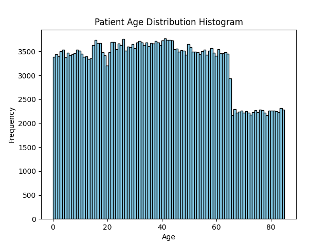
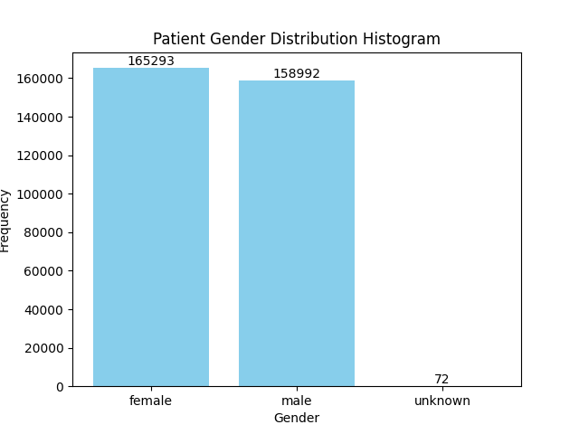
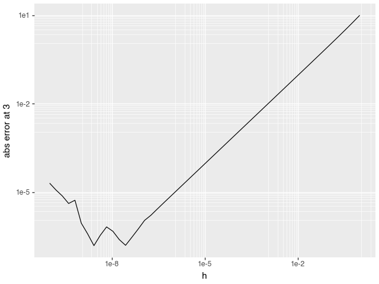
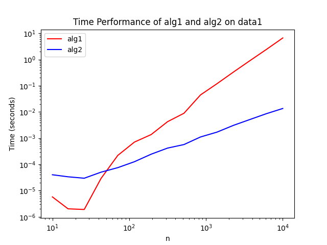
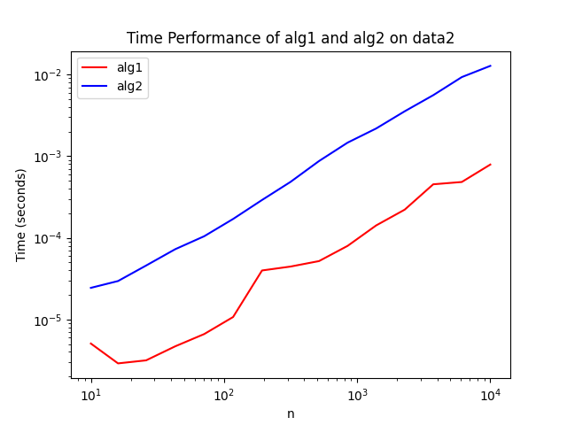
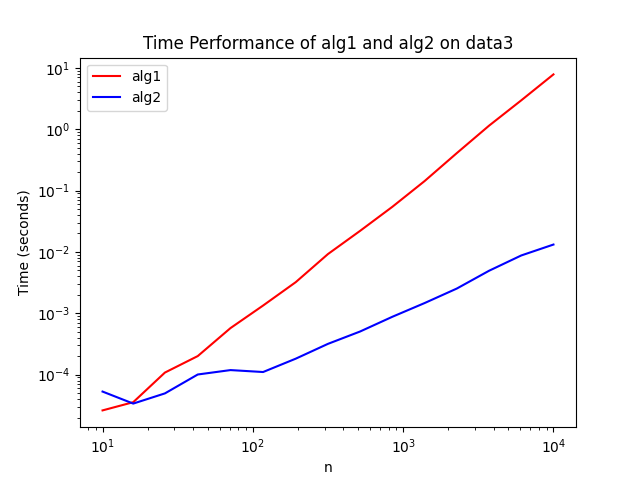
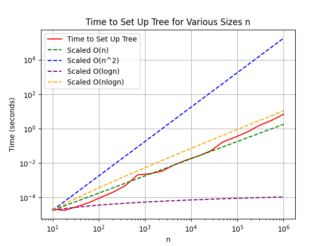
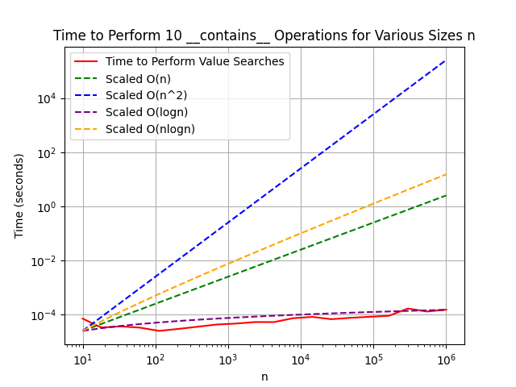
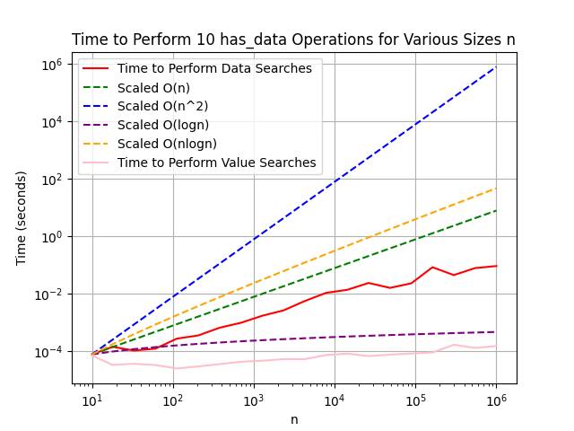

# Skills Demonstrated:
## Data parsing & wrangling
Parsed and queried a large XML dataset, including attribute extraction and filtering.
## Data visualization
Built histograms, bar charts, and log-log plots with matplotlib and plotnine/ggplot-style grammar-of-graphics syntax; annotated plots with computed values.
## Algorithm design & implementation
Implemented binary search, boundary-search (bisection) variants for range queries, bubble sort (alg1), and a merge sort (alg2) from scratch without relying on built-in library implementations.
## Recursive data structures
Designed and implemented a binary search tree (BST) from a bare class skeleton.
## Algorithmic complexity analysis (Big-O)
Reasoned about and empirically validated time complexity (O(log n), O(n), O(n log n), O(n²)) by benchmarking real runtimes with time.perf_counter, plotting results against scaled reference curves on log-log axes, and interpreting where empirical results matched or diverged from theory.
## Performance benchmarking methodology
Experiments using numpy.logspace for evenly-spaced sample sizes on a log scale, isolated the operation under test from setup/data-generation cost, and used repeated trials to avoid single-point bias.
## Numerical computing & floating-point literacy
Investigated IEEE 754 floating-point precision limits (loss of precision in large-number addition, and instability in finite-difference derivative approximations as step size shrinks).
## Testing & validation practices
Wrote and documented explicit test cases (including edge cases like negative numbers, floats, and empty strings) to verify correctness of custom data structures and functions before relying on them.
## Technical writing & communication
Documented methodology, hypotheses, and conclusions clearly enough for a third party to follow and verify.

# Exercise 1
## Instructions
Running the script will print out all the responses either in graphs or in terminal in top down order. Some tests are commented out, but those were for checking different values, and can be uncommented if need be.
## Q1a
Histogram of ages <br/>
 <br/>
No ages appeared more than once among the list of patients. This is done in the code by creating a dictionary with the ages as the keys and the values being the number of times it appeared. Since the filtered dictionary containing only duplicate ages contained no values, we an conclude that there were no duplicate ages. <br/>
Extra Credit: If multiple patients had the same age, it would affect how we sort patients by age, as well as defining bounds when querying ages. When it comes to sorting patients by age, we can come across a problem where if multiple people have the same age, we need to place them next to each other. For defining bounds, we would need to make sure to include all people of the same age and not accidentally exclude people if we found another person of the same age at an earlier time.

## Q1b
Bar plot of genders <br/>
 <br/>
The gender is encoded in the data as string with the options of male, female, and unknown. In the bar plot, I included the number of times each gender occurred, and the unknown value matched the number of times unknown appeared with command + f in the xml file (male and female occurred too many times to be accurately counted with command + f in the xml file).

## Q1c
The oldest patient is Monica Caponera at 84.99855742449432 years old.

## Q1d
To find the second oldest patient in O(n) time (assuming an unsorted list), you would iterate through the list once. While iterating through the list, you would hold onto two values: the oldest patient and the second oldest patient. As you iterate through the list, you would compare the current value to the oldest and second oldest values and replace with the current value when appropriate. After iterating through the list, the second oldest patient will be saved to the second oldest patient variable. <br/>
One scenario where it is advantageous to sort the data vs using the O(n) solution is when you have to find multiple items in the list. This is because once the data is sorted, any future searches would take constant time, which will end up being faster than O(n) speed in the long run. <br/>
Another scenario where it's better to sort the data than use the O(n) solution is if you need to check for duplicate ages. Instead of iterating through the entire list and taking O(n) time, a sorted list would allow you to compare adjacent values and see if there are duplicate ages. <br/>
A sorted list would also be advantageous compared to the O(n) solution when finding statistical metrics such as median, quartile, etc. because you can directly go to a specific portion of the list in constant time instead of having to iterate through the entire list. <br/>

## Q1e
John Braswell is exactly 41.5 years old

## Q1f
There are 150,471 number of patients who are at least 41.5 years old

## Q1g
The following test were ran with the script and checked by using command f in xml to see how many values match the desired prefix: <br/>
There are 4368 patients between ages 43 and 44 <br/>
There are 42 patients between ages 56.5 and 56.51 <br/>
There are 2019 patients between ages 2 and 2.5 <br/>
There are 16215 patients between ages 3 and 7 <br/>
There are 5329 patients between ages 79 and 81 <br/>

## Q1h
The following test were ran with the script and checked by seeing if the number of male patients is approximately half the respective values found in Q1g: <br/>
There are 2188 male patients between ages 43 and 44 <br/>
There are 18 male patients between ages 56.5 and 56.51 <br/>
There are 966 male patients between ages 2 and 2.5 <br/>
There are 8369 male patients between ages 3 and 7 <br/>
There are 2462 male patients between ages 79 and 81 <br/>

# Exercise 2
## Instructions
Running the script will first return if 2e16 == 2 * 10 ** 16 and 2e16 + 1 == 2 * 10 ** 16 + 1 are true or false. Following, part 2b's graph will be displayed.

## Q2a
While 2e16 == 2 * 10 ** 16 returns true, once you add 1 to both sides (2e16 + 1 == 2 * 10 ** 16 + 1), it returns false. This is because the left side of the comparison is a float and the right side of the comparison is an int. Since the left side is a float, that means it can only have a certain amount of precision (approximately 16 significant digits), so adding 1 would get lost due to the lack of precision and 2e16 + 1 == 2e16. As for the right side, since it is an int, the size is variable and the addition of 1 would not get lost to a lack of precision.

## Q2b
 <br/>
The use of logspace makes it so that the plotted h values show up on a logarithmic scale, and a log-log plot is used so that we can observe how h and error behave on different orders of magnitude (which is appropriate when talking about derivatives and limits). <br/>
As h gets smaller and smaller, the error decreases at a constant rate, until around a value slightly bigger than 1e-8. Once it gets to that point, the error follows a seemingly random trend, followed by an increase in error as h gets smaller. <br/>
The change in trend is caused by float operations losing precision once we get to very small differences, particularly in the part where (f(x0 + h) - f(x0)) / h. For the hypothesis, once the h value gets to a small enough threshold, we start losing precision and the difference in the numerator doesn't decrease according to the theory. If we go even to even smaller h values, rounding errors for (f(x0 + h) - f(x0)) / h start to accumulate because of how small h is, and we start getting an increase in error. <br/>
For the region where the error begins to deviate from the theory but doesn't yet begin an increase in error, if we had an h small enough to cause a rounding error, we would lose some accuracy. When we get to really small h values, the h in the denominator also would lose precision, causing an upward trend in error (for example, if we had h = 1.1e-10 and the denominator rounds down to 1e-10.) <br/>

# Exercise 3
## Instructions
Running the script prints out tests (some are commented out for 3a) and the 3 graphs for alg speeds on different data
## Q3a
alg1 and alg2 sorts the list into increasing order. <br/>
I ran tests with all three data sets at sizes 10, 100, and 1000. <br/>
Data 1 returns a list of values that go up and down (not seen when n = 10, but seen when n = 100, 1000). alg1 and alg2 sorts the list into increasing order, and this is especially seen when n = 100, 1000 (since at n = 10, Data 1 is already in increasing order). <br/>
Data 2 already returns a list of ints from 0 to n-1 in increasing order, so alg1 and alg2 don't have an effect on the list. <br/>
Data 3 returns a list of ints from n to 1 in decreasing order, so alg1 and alg2 returns the list in increasing order for all n sizes <br/>

## Q3b
alg1 is implemented by having a for loop nested inside a while loop. When iterating through the for loop, we compare the values at the next index and the current index. If the value at the next index is smaller than the value at the current index, the two values will get swapped. The for loop is repeated until we do a full iteration with no swaps, and at that point we exit the while loop and return the sorted (in increasing order) list. <br/>
alg2 sorts the list through a recursive method. alg2 recursively divides the list in half, until each list only has 1 item (base case). Once this happens, merges occur (between the appropriate pairs of numbers/lists) and it does this by getting the lowest value between the two lists being merged and appending it to a new list. The new list will be in increasing order, having the values of the two lists that were merged. This merging process repeats until we get back to the full list, and we ultimately get the original list in increasing order. <br/>

## Q3c
Based on the data and plots generated below (primarily with data 1 and data 3), the apparent big-O scaling of alg1 is O(n^2) and the apparent big-O scaling of alg2 is O(nlogn) <br/>

 <br/>
The times to sort data 1 with algorithm 1 are:, [5.745998350903392e-06, 2.0169973140582442e-06, 1.9029976101592183e-06, 2.9104994609951973e-05, 0.00021928000205662102, 0.0007075169996824116, 0.0013681179989362136, 0.004247646997100674, 0.00890853299642913, 0.04448130899982061, 0.11902575599378906, 0.3312297450029291, 0.8995904080002219, 2.4097509589992114, 6.626435036996554] <br/>
The times to sort data 1 with algorithm 2 are:, [4.017100582132116e-05, 3.3575997804291546e-05, 2.9623006412293762e-05, 5.041999975219369e-05, 7.494899909943342e-05, 0.00012627900287043303, 0.00024407800083281472, 0.00041780300671234727, 0.0005700160036212765, 0.0011086790036642924, 0.0016960590000962839, 0.0030706890029250644, 0.005135236999194603, 0.008564110001316294, 0.013538844999857247] <br/>

 <br/>
The times to sort data 2 with algorithm 1 are:, [5.06699871039018e-06, 2.8950016712769866e-06, 3.1529998523183167e-06, 4.682995495386422e-06, 6.62199454382062e-06, 1.0707997716963291e-05, 3.982700582128018e-05, 4.447499668458477e-05, 5.188799696043134e-05, 7.972900493768975e-05, 0.00014193999959388748, 0.00022148500283947214, 0.00045299899647943676, 0.00048351599980378523, 0.0007907930048531853] <br/>
The times to sort data 2 with algorithm 2 are:, [2.438900264678523e-05, 2.9551003535743803e-05, 4.577099753078073e-05, 7.253300282172859e-05, 0.00010461099736858159, 0.00017024500266415998, 0.0002909239992732182, 0.00048494899965589866, 0.0008727629974600859, 0.0014684139969176613, 0.0021881020002183504, 0.0035543439953471534, 0.005600192998826969, 0.009324463004304562, 0.012799759999325033] <br/>

 <br/>
The times to sort data 3 with algorithm 1 are:, [2.611799573060125e-05, 3.553800343070179e-05, 0.00010807299986481667, 0.00020065699936822057, 0.0005737100000260398, 0.0013377299983403645, 0.0032196359970839694, 0.00923315800173441, 0.02205654900171794, 0.05447917999845231, 0.1429771580005763, 0.40841065299900947, 1.1428902019979432, 2.958630610999535, 7.834880599002645] <br/>
The times to sort data 3 with algorithm 2 are:, [5.296400195220485e-05, 3.373000072315335e-05, 4.944299871567637e-05, 0.00010051400022348389, 0.00011859899677801877, 0.00011029400047846138, 0.00018212100258097053, 0.0003173950026393868, 0.0005046059959568083, 0.0008776390022831038, 0.0014679359956062399, 0.0025302630019723438, 0.004932398995151743, 0.008760668999457266, 0.013197124004364014] <br/>

## Q3d
Across all 3 data sets, as the n increases, the time it takes for the algorithm to finish also increases. However, the type of data affects the speed of the algorithms. In data 1, we have an unordered set, and alg2 generally finishes faster than alg1 since alg2 has O(nlogn) while alg1 has O(n^2). In data 2, we have an ordered set, and alg1 is faster than alg2. This is because while alg2 stays at O(nlogn), since the data is already sorted, alg1 only need to pass through the values once, therefore having a faster speed of n. Lastly, in data 3, we have a more extreme pattern of what we saw in data 1, as it is the worst case scenario, so alg2 would be faster than alg1 since O(nlogn) < O(n^2). <br/>
I would recommend alg1 for when we have small datasets and/or the datasets is near/fully sorted to begin with. In these scenarios, either the number of values we must compare is small enough to where it doesn't take long (seen at the beginning of data 1 and data 3), or the sets are already ordered enough to have a minimal amount of loops (seen in data 2), getting as close to n time as possible. <br/>
As for alg2, I would recommend it when we have large datasets and/or unordered datasets since it scales better than alg1 (O(nlogn) < O(n^2)). This is seen in data 1 and data 3, where as n grows, the time it takes for the alg2 to complete stays below the time it takes alg1 to complete.

# Exercise 4
## Instructions
Running the script will print out all of the tests in terminal and then proceed to display the graphs for time to set up the trees, perform contains operation, and perform has_data operation (in that order).

## Q4a
After only implementing the add method, I ran the script and nothing was returned. This was expected at the time, but I wanted to check that the values were properly being added into the tree instead of the script running into no errors but failing to add to the tree. To check the validity of my tree, I added a function that returns the contents of the tree in order by recursively adding elements to a list.

## Q4b
The following was the result of 10 tests, where the first 5 should return True and the last 5 should return False: <br/>
24601 in my_tree: True <br/>
42 in my_tree: True <br/>
7 in my_tree: True <br/>
143 in my_tree: True <br/>
8675309 in my_tree: True <br/>
5 in my_tree: False <br/>
1286 in my_tree: False <br/>
9989989 in my_tree: False <br/>
-7 in my_tree: False <br/>
4.2 in my_tree: False <br/>

I used the values provided in part 4a, and those return True in the first 5 tests. For the last 5 tests, I wanted to make sure that it returned False when the value is not in the tree, also checking if certain numbers (such as negatives or floats) would have a weird interaction with the in function. In the end, the script returned the proper response for each of the values.

## Q4c
The following was the result of 10 tests, where the first 5 should return True and the last 5 should return False: <br/>
Data = JV in my_tree: True <br/>
Data = DA in my_tree: True <br/>
Data = JB in my_tree: True <br/>
Data = FR in my_tree: True <br/>
Data = JNY in my_tree: True <br/>
Data = 42 in my_tree: False <br/>
Data = 5 in my_tree: False <br/>
Data = 182 in my_tree: False <br/>
Data = HIJ in my_tree: False <br/>
Data =  in my_tree: False <br/>

I used the data provided in part 4a, and those return True for the first 5 tests. For the last 5 tests, I wanted to make sure I wasn't checking the value, so tests 6, 7, and 8 are values that are in the tree, but those still returned False, showing that I'm checking for data instead of value. For tests 9 and 10, I wanted to make sure that has_data only returned True for values that were in the tree, so I tested it with 'HIJ' and '', which those both properly returned False.

## Q4d
When populating the trees of various sizes with random patient IDs and associated data, I chose a range of [1-2n] for randomly generated patient IDs and generated random 3 letter uppercase strings for the data so that there's a chance the ID or data would be absent from the tree. When setting up the trees, the graph below shows the time it took to generate trees of size n. I added scaled n, n^2, logn, and nlogn dotted lines to serve as a reference and more easily observe the rate at which the operations approach. <br/>
 <br/>
Based on the graph shown above, we can see that the growth at sufficiently large n falls between O(n) and O(n^2) (red line is between the green and blue line). <br/>

When timing the __contains__ method, I performed 10 searches on random integer IDs within the range of [1-2n] for every tree. <br/>
 <br/>
As seen in the above graph, the __contains__ method approaches O(logn) for sufficiently large n (red and purple lines match up with each other quite well, especially at larger n's). <br/>

When timing the has_data method, I once again performed 10 searches for random 3 letter uppercase strings for every tree. <br/>
 <br/>
In the above graph, we can see that while it takes longer than O(logn), it consistently takes less time than O(n). This is because the has_data function has to check each node's data because the tree is sorted based on the ID. <br/>

The __contains__ method is generally faster than the has_data method, where __contains__ is closer to O(logn) while has_data is closer to O(n). This is because the __contains__ method searches for IDs which are sorted in the tree, allowing us to remove half of the IDs each time we go down a node. The has_data method searches for data which is not sorted in the tree, so we must go through the entire tree until we find the desired data, which takes at most O(n) time.

## Q4e
It is unrepresentative to always use a specific value/one test point for performance analysis because it can skew the results to either low or high extremes. For example, if in this exercise we only searched for patient_id = 1, we would only have to search the left child of each node and not have to bother searching the right nodes, making it faster than some other numbers. Another extreme example is if we had a constant id as the root, and we only searched for the constant id. The program would perform at constant time since we come across the root first, but that is very much not representative of the actual time complexity (which was observed in previous parts of exercise 4). Because using specific values/too few test points can lead to skewed performance analysis, it's important to choose appropriate test data to accurately assess performance.

# Exercise 5
https://www.kaggle.com/datasets/rabieelkharoua/chronic-kidney-disease-dataset-analysis <br/>
The dataset above is about patients diagnosed with chronic kidney disease (CKD). It contains a variety of different features that may impact CKD, ranging from past medical history to socioeconomic factors. <br/>
I found the dataset on kaggle by filtering health with the healthcare tag and making sure there was a Creative Commons license. <br/>
The license for this dataset is CC BY 4.0 <br/>
I think this dataset is interesting because it has many features that can be looked at to find correlations between CKD and a specific feature, as well as see if there are correlations between features themselves. <br/>
One question I want to explore with this data is to see which features have the strongest correlation with CKD. Even though the dataset only contains CKD diagnosed patients, I believe we can at least determine which demographics have higher frequencies in the dataset. <br/>
Another question I can ask is whether or not strong correlations exist between the features themselves. For example, I might want to see if there is a strong correlation and the type of symptoms experienced by CKD patients.

# Appendix
## Exercise 1
```python
import xml.etree.ElementTree as ET
import matplotlib.pyplot as plt
from tqdm import tqdm

#Q1a -------------------------------------------------------------------

tree = ET.parse("problem_set_1/hw1-patients.xml")
root = tree.getroot()

ages = []
for patient in root.findall("patients/patient"):
    ages.append(float(patient.get("age")))

# print(ages)

plt.hist(ages, bins = 100, color='skyblue', edgecolor='black')
plt.xlabel('Age')
plt.ylabel('Frequency')
plt.title('Patient Age Distribution Histogram')
plt.show()

duplicates = {}
for age in tqdm(ages, desc="Checking for duplicates"):
    if age in duplicates:
        duplicates[age] += 1
    else:
        duplicates[age] = 1

duplicate_ages = {age: count for age, count in duplicates.items() if count > 1}

if duplicate_ages:
    print("The following ages belong to multiple patients")
    for age, count in duplicate_ages.items():
        print("Age:", age, ", Count:", count)
else:
    print("No ages appear more than once among the list of patients")

#Q1b --------------------------------------------------------------------
    
gender = {}
for patient in root.findall("patients/patient"):
    if patient.get("gender") not in gender:
        gender[patient.get("gender")] = 1
    else:
        gender[patient.get("gender")] += 1

plt.bar(gender.keys(), gender.values(), color='skyblue')
for i, gender_count in enumerate(gender.values()):
    plt.text(i, gender_count + 0.5, str(gender_count), ha='center', va='bottom')
plt.xlabel('Gender')
plt.ylabel('Frequency')
plt.title('Patient Gender Distribution Histogram')
plt.show()

#Q1c --------------------------------------------------------------------

sorted_patients = sorted(root.findall("patients/patient"), key = lambda patient: float(patient.get("age")))
print("The oldest patient is", sorted_patients[-1].get("name"), "at", sorted_patients[-1].get("age"), "years old")

#Q1d --------------------------------------------------------------------
#Answer in README

#Q1e --------------------------------------------------------------------

def binary_search(patients, target_age):
    low_bound = 0
    high_bound = len(patients) - 1
    while low_bound <= high_bound:
        mid = (low_bound + high_bound) // 2
        mid_age = float(patients[mid].get("age"))
        if mid_age < target_age:
            low_bound = mid + 1
        elif mid_age > target_age:
            high_bound = mid - 1
        else:
            return patients[mid]
    return None

specific_age_patient = binary_search(sorted_patients, 41.5)

print("The patient that is exactly 41.5 years old is", specific_age_patient.get("name"))

#Q1f --------------------------------------------------------------------

age_index = sorted_patients.index(specific_age_patient)
at_least_age = len(sorted_patients) - age_index
print("There are", at_least_age, "number of patients who are at least 41.5 years old")

#Q1g --------------------------------------------------------------------

def left_boundary(patients, target_age):
    low_bound = 0
    high_bound = len(patients) - 1
    while low_bound < high_bound:
        mid = (low_bound + high_bound) // 2
        mid_age = float(patients[mid].get("age"))
        if mid_age < target_age:
            low_bound = mid + 1
        else:
            high_bound = mid
    return low_bound

def age_range(patients, low_age, high_age):
    lower_age_bound = left_boundary(patients, low_age)
    upper_age_bound = left_boundary(patients, high_age)
    index_range = upper_age_bound - lower_age_bound
    print("There are", index_range, "patients between ages", low_age, "and", high_age)

# age_range(sorted_patients, 43, 44)
# age_range(sorted_patients, 56.5, 56.51)
# age_range(sorted_patients, 2, 2.5)
# age_range(sorted_patients, 3, 7)
age_range(sorted_patients, 79, 81)

#Q1h --------------------------------------------------------------------

def age_gender_range(patients, low_age, high_age, gender):
    left_bound = left_boundary(patients, low_age)
    right_bound = left_boundary(patients, high_age)
    patients_in_range = patients[left_bound:right_bound]
    gender_count = sum(1 for patient in patients_in_range if patient.get("gender") == "male")
    print("There are", gender_count, gender, "patients between ages", low_age, "and", high_age)

# age_gender_range(sorted_patients, 43, 44, "male")
# age_gender_range(sorted_patients, 56.5, 56.51, "male")
# age_gender_range(sorted_patients, 2, 2.5, "male")
# age_gender_range(sorted_patients, 3, 7, "male")
age_gender_range(sorted_patients, 79, 81, "male")
```

## Exercise 2
```python
#Q2a -------------------------------------------------------------------

print("Before addition, 2e16 == 2 * 10 ** 16 returns", 2e16 == 2 * 10 ** 16)

print("After addition, 2e16 + 1 == 2 * 10 ** 16 + 1 returns", 2e16 + 1 == 2 * 10 ** 16 + 1)

#Q2b -------------------------------------------------------------------

import numpy as np
import plotnine as p9
import pandas as pd

x0 = 3
h = np.logspace(-10, 0)
f = lambda x: x**3

error = abs(((f(x0 + h) - f(x0)) / h) - 3 * x0**2)

print(
    p9.ggplot(pd.DataFrame({"h": h, f"abs error at {x0}": error}))
    + p9.geom_line(p9.aes(x="h", y=f"abs error at {x0}"))
    + p9.scale_x_log10()
    + p9.scale_y_log10()
)
```

## Exercise 3
```python
def alg1(data):
    data = list(data)
    changes = True
    while changes:
        changes = False
        for i in range(len(data) - 1):
            if data[i + 1] < data[i]:
                data[i], data[i + 1] = data[i + 1], data[i]
                changes = True
    return data

def alg2(data):
    if len(data) <= 1:
        return data
    else:
        split = len(data) // 2
        left = iter(alg2(data[:split]))
        right = iter(alg2(data[split:]))
        result = []
        # note: this takes the top items off the left and right piles
        left_top = next(left)
        right_top = next(right)
        while True:
            if left_top < right_top:
                result.append(left_top)
                try:
                    left_top = next(left)
                except StopIteration:
                    # nothing remains on the left; add the right + return
                    return result + [right_top] + list(right)
            else:
                result.append(right_top)
                try:
                    right_top = next(right)
                except StopIteration:
                    # nothing remains on the right; add the left + return
                    return result + [left_top] + list(left)
                
def data1(n, sigma=10, rho=28, beta=8/3, dt=0.01, x=1, y=1, z=1):
    import numpy
    state = numpy.array([x, y, z], dtype=float)
    result = []
    for _ in range(n):
        x, y, z = state
        state += dt * numpy.array([
            sigma * (y - x),
            x * (rho - z) - y,
            x * y - beta * z
        ])
        result.append(float(state[0] + 30))
    return result

def data2(n):
    return list(range(n))

def data3(n):
    return list(range(n, 0, -1))

#Q3a -------------------------------------------------------------------

data1_10 = data1(10)
data2_10 = data2(10)
data3_10 = data3(10)

print("data1_10 is composed of", data1_10)
print("After alg 1, data1_10 becomes", alg1(data1_10))
print("After alg 2, data1_10 becomes", alg2(data1_10), end="\n\n")

print("data2_10 is composed of", data2_10)
print("After alg 1, data2_10 becomes", alg1(data2_10))
print("After alg 2, data2_10 becomes", alg2(data2_10), end="\n\n")

print("data3_10 is composed of", data3_10)
print("After alg 1, data3_10 becomes", alg1(data3_10))
print("After alg 2, data3_10 becomes", alg2(data3_10), end="\n\n")

# data1_100 = data1(100)
# data2_100 = data2(100)
# data3_100 = data3(100)

# print("data1_100 is composed of", data1_100)
# print("After alg 1, data1_100 becomes", alg1(data1_100))
# print("After alg 2, data1_100 becomes", alg2(data1_100), end="\n\n")

# print("data2_100 is composed of", data2_100)
# print("After alg 1, data2_100 becomes", alg1(data2_100))
# print("After alg 2, data2_100 becomes", alg2(data2_100), end="\n\n")

# print("data3_100 is composed of", data3_100)
# print("After alg 1, data3_100 becomes", alg1(data3_100))
# print("After alg 2, data3_100 becomes", alg2(data3_100), end="\n\n")

# data1_1000 = data1(1000)
# data2_1000 = data2(1000)
# data3_1000 = data3(1000)

# print("data1_1000 is composed of", data1_1000)
# print("After alg 1, data1_1000 becomes", alg1(data1_1000))
# print("After alg 2, data1_1000 becomes", alg2(data1_1000), end="\n\n")

# print("data2_1000 is composed of", data2_1000)
# print("After alg 1, data2_1000 becomes", alg1(data2_1000))
# print("After alg 2, data2_1000 becomes", alg2(data2_1000), end="\n\n")

# print("data3_1000 is composed of", data3_1000)
# print("After alg 1, data3_1000 becomes", alg1(data3_1000))
# print("After alg 2, data3_1000 becomes", alg2(data3_1000), end="\n\n")

#Q3b -------------------------------------------------------------------

#Answer in README

#Q3c -------------------------------------------------------------------

import numpy as np
import time
import matplotlib.pyplot as plt
from tqdm import tqdm

n_values = np.logspace(1, 4, num=15, dtype=int)

def time_alg(alg, data_function, n_values):
    alg_times = []
    for n in tqdm(n_values, desc="Timing Algorithm"):
        data = data_function(n)
        start = time.perf_counter()
        alg(data)
        alg_times.append(time.perf_counter() - start)
    return alg_times

def time_plot(alg1_times, alg2_times, n_values, title):
    plt.loglog(n_values, alg1_times, label="alg1", color = "red")
    plt.loglog(n_values, alg2_times, label="alg2", color = "blue")
    plt.xlabel('n')
    plt.ylabel('Time (seconds)')
    plt.title(title)
    plt.legend()
    plt.show()

data_1_alg_1 = time_alg(alg1, data1, n_values)
data_1_alg_2 = time_alg(alg2, data1, n_values)
print("The times to sort data 1 with algorithm 1 are:,", data_1_alg_1)
print("The times to sort data 1 with algorithm 2 are:,", data_1_alg_2)
time_plot(data_1_alg_1, data_1_alg_2, n_values, "Time Performance of alg1 and alg2 on data1")

data_2_alg_1 = time_alg(alg1, data2, n_values)
data_2_alg_2 = time_alg(alg2, data2, n_values)
print("The times to sort data 2 with algorithm 1 are:,", data_2_alg_1)
print("The times to sort data 2 with algorithm 2 are:,", data_2_alg_2)
time_plot(data_2_alg_1, data_2_alg_2, n_values, "Time Performance of alg1 and alg2 on data2")

data_3_alg_1 = time_alg(alg1, data3, n_values)
data_3_alg_2 = time_alg(alg2, data3, n_values)
print("The times to sort data 3 with algorithm 1 are:,", data_3_alg_1)
print("The times to sort data 3 with algorithm 2 are:,", data_3_alg_2)
time_plot(data_3_alg_1, data_3_alg_2, n_values, "Time Performance of alg1 and alg2 on data3")

#Q3d -------------------------------------------------------------------

#Answers in README
```

## Exercise 4
```python
import numpy as np
import time
import matplotlib.pyplot as plt
from tqdm import tqdm
import random
import string

class Tree:
    def __init__(self):
        self._value = None
        self._data = None
        self.left = None
        self.right = None

    #Q4a -------------------------------------------------------------------

    def add(self, value, data):
        if self._value is None:
            self._value = value
            self._data = data
        elif value < self._value:
            if self.left is None:
                self.left = Tree()
            self.left.add(value, data)
        elif value > self._value:
            if self.right is None:
                self.right = Tree()
            self.right.add(value, data)
        else:
            self._data = data

    #Added this section to see if values were properly added to the tree for Q4a
    def tree_in_order(self):
        tree_result = []
        if self.left:
            tree_result += self.left.tree_in_order()
        tree_result.append((self._value, self._data))
        if self.right:
            tree_result += self.right.tree_in_order()
        return tree_result
    
    #Q4b -------------------------------------------------------------------
    def __contains__(self, patient_id):
        if self._value == patient_id:
            return True
        elif self.left and patient_id < self._value:
            return patient_id in self.left
        elif self.right and patient_id > self._value:
            return patient_id in self.right
        else:
            return False
        
    #Q4c -------------------------------------------------------------------
    def has_data(self, patient_data):
        if self._data == patient_data:
            return True
        elif self.left and self.left.has_data(patient_data):
            return True
        elif self.right and self.right.has_data(patient_data):
            return True
        return False
        
#Q4a Testing -------------------------------------------------------------------
my_tree = Tree()
for patient_id, initials in [(24601, "JV"), (42, "DA"), (7, "JB"), (143, "FR"), (8675309, "JNY")]:
    my_tree.add(patient_id, initials)
print(my_tree.tree_in_order())

#Q4b Testing -------------------------------------------------------------------
print("24601 in my_tree:", 24601 in my_tree)
print("42 in my_tree:", 42 in my_tree)
print("7 in my_tree:", 7 in my_tree)
print("143 in my_tree:", 143 in my_tree)
print("8675309 in my_tree:", 8675309 in my_tree)
print("5 in my_tree:", 5 in my_tree)
print("1286 in my_tree:", 1286 in my_tree)
print("9989989 in my_tree:", 9989989 in my_tree)
print("-7 in my_tree:", -7 in my_tree)
print("4.2 in my_tree:", 4.2 in my_tree)

#Q4c Testing -------------------------------------------------------------------
print("Data = JV in my_tree:", my_tree.has_data('JV'))
print("Data = DA in my_tree:", my_tree.has_data('DA'))
print("Data = JB in my_tree:", my_tree.has_data('JB'))
print("Data = FR in my_tree:", my_tree.has_data('FR'))
print("Data = JNY in my_tree:", my_tree.has_data('JNY'))
print("Data = 42 in my_tree:", my_tree.has_data(42))
print("Data = 5 in my_tree:", my_tree.has_data(5))
print("Data = 182 in my_tree:", my_tree.has_data(182))
print("Data = HIJ in my_tree:", my_tree.has_data('HIJ'))
print("Data =  in my_tree:", my_tree.has_data(''))

#Q4d -------------------------------------------------------------------
def random_uppercase_string():
    return ''.join(random.choice(string.ascii_uppercase) for _ in range(3))

def time_plot(times, n_values, title, data_label):
    min_time = min(times)

    O_n = n_values
    O_n_squared = n_values ** 2
    O_log_n = np.log(n_values)
    O_n_log_n = n_values * np.log(n_values)

    O_n_scaled = O_n * (min_time / O_n[0])
    O_n_squared_scaled = O_n_squared * (min_time / O_n_squared[0])
    O_log_n_scaled = O_log_n * (min_time / O_log_n[0])
    O_n_log_n_scaled = O_n_log_n * (min_time / O_n_log_n[0])

    plt.loglog(n_values, times, label = data_label, color = "red")
    plt.loglog(n_values, O_n_scaled, label = 'Scaled O(n)', color='green', linestyle='--')
    plt.loglog(n_values, O_n_squared_scaled, label = 'Scaled O(n^2)', color='blue', linestyle='--')
    plt.loglog(n_values, O_log_n_scaled, label = 'Scaled O(logn)', color='purple', linestyle='--')
    plt.loglog(n_values, O_n_log_n_scaled, label = 'Scaled O(nlogn)', color='orange', linestyle='--')

    plt.xlabel('n')
    plt.ylabel('Time (seconds)')
    plt.title(title)
    plt.legend()
    plt.grid(True)

def setup_time(n_values):
    list_of_trees = []
    setup_time_list = []
    for n in tqdm(n_values, desc="Timing Setup"):
        random_value_list = random.sample(range(1, 2 * n + 1), n)
        random_string_list = [random_uppercase_string() for _ in range(n)]
        start = time.perf_counter()
        n_tree = Tree()
        for patient_id, initials in zip(random_value_list, random_string_list):
            n_tree.add(patient_id, initials)
        setup_time_list.append(time.perf_counter() - start)
        list_of_trees.append(n_tree)
        # print(n_tree.tree_in_order())
    time_plot(setup_time_list, n_values, "Time to Set Up Tree for Various Sizes n", "Time to Set Up Tree")
    plt.show()
    return list_of_trees

def contains_time(n_values, tree_list, searches):
    contains_time_list = []
    tree_index = 0
    for n in tqdm(n_values, desc="Timing __contains__"):
        start = time.perf_counter()
        for _ in range(searches):
            random_value = random.randint(1, 2 * n)
            random_value in tree_list[tree_index]
        contains_time_list.append(time.perf_counter() - start)
        tree_index += 1
    contains_graph_title = "Time to Perform " + str(searches) + " __contains__ Operations for Various Sizes n"
    time_plot(contains_time_list, n_values, contains_graph_title, "Time to Perform Value Searches")
    plt.show()
    return contains_time_list

def has_data(n_values, tree_list, searches, contains_time_list):
    has_data_time_list = []
    tree_index = 0
    for n in tqdm(n_values, desc="Timing has_data"):
        start = time.perf_counter()
        for _ in range(searches):
            random_data = random_uppercase_string()
            tree_list[tree_index].has_data(random_data)
        has_data_time_list.append(time.perf_counter() - start)
        tree_index += 1
    has_data_graph_title = "Time to Perform " + str(searches) + " has_data Operations for Various Sizes n"
    time_plot(has_data_time_list, n_values, has_data_graph_title, "Time to Perform Data Searches")
    #Adding __contains__ times to the graph
    plt.loglog(n_values, contains_time_list, label = "Time to Perform Value Searches", color = "pink")
    plt.legend()
    plt.show()
    
n_values = np.logspace(1, 6, num=20, dtype=int)

tree_list = setup_time(n_values)
contains_time_list = contains_time(n_values, tree_list, 10)
has_data(n_values, tree_list, 10, contains_time_list)

#Q4e -------------------------------------------------------------------
#Answer in README
```