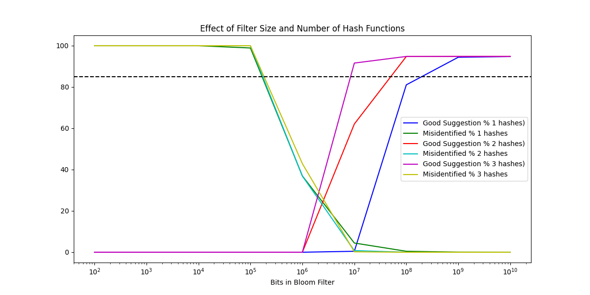
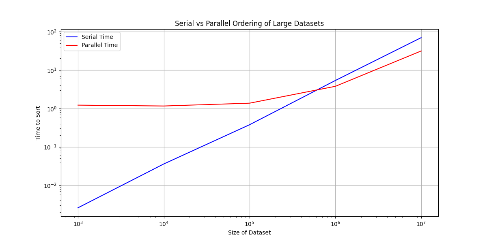
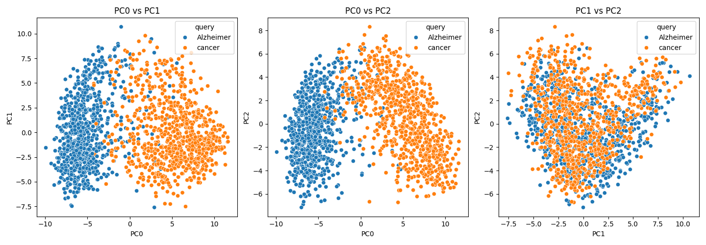

# Skills Demonstrated:
## Probabilistic data structures & hashing
Implemented a Bloom filter from scratch (bitarray, SHA-256, BLAKE2b, SHA3-256) to reason about space/accuracy trade-offs, analogous to how Bloom filters are used in genomics for k-mer/variant lookups.
## Algorithm design & analysis
Adapted a divide-and-conquer merge sort to support key-based sorting of structured records (e.g., patient ID + associated data), and empirically benchmarked serial vs. parallel performance across dataset sizes.
## Parallel / concurrent computing
Used Python's multiprocessing (Pool) to distribute sorting workloads across CPU cores, measured real speedups, and reasoned about the overhead/break-even point where parallelism pays off.
## REST API integration at scale
Queried NCBI's Entrez E-utilities to programmatically retrieve and paginate PubMed records, respecting API rate limits and batching requests to minimize call volume.
## XML parsing & robust data extraction
Parsed nested, inconsistently structured XML using xml.etree.ElementTree, producing clean, reusable JSON metadata.
## NLP / transformer embeddings
Used a pretrained transformer (SPECTER) via HuggingFace transformers to embed scientific titles/abstracts into dense 768-dimensional vector representations.
## Dimensionality reduction & unsupervised analysis
Applied PCA to project high-dimensional embeddings into interpretable 2D space and evaluated cluster separability between research domains.
## Data visualization
Produced multi-panel comparative plots (matplotlib, seaborn) to communicate quantitative trade-offs (filter size vs. accuracy, serial vs. parallel runtime) and qualitative structure (embedding clusters).

# Exercise 1
## Instructions
Running the script will output the tests for the self-check, and it will then start generating the graph for question c (though it takes quite a while in my opinion)
## Q1a/Q1b Self-check
I checked the functionality of my code using the self-check example.<br/>
Using 1 hash, I got the following: <br/>
bloom_filter_1e7_1hash.check_word("flower") = True <br/>
bloom_filter_1e7_1hash.spell_check("floeer") = ['bloeer', 'qloeer', 'fyoeer', 'flofer', 'floter', 'flower', 'floeqr', 'floees'] <br/>
Using 2 hashes, I got the following: <br/>
bloom_filter_1e7_2hash.check_word("flower") = True <br/>
bloom_filter_1e7_2hash.spell_check("floeer") = ['fyoeer', 'floter', 'flower'] <br/>
Using 3 hashes, I got the following: <br/>
bloom_filter_1e7_3hash.check_word("flower") = True <br/>
bloom_filter_1e7_3hash.spell_check("floeer") = ['floter', 'flower'] <br/>

## Q1c
 <br/>
By seeing where the hash function lines intersect with the dotted line indicating 85% good suggestions, I'd approximate the following: <br/>
1 hash function reaches 85% good suggestions around 2.0x10^8 <br/>
2 hash functions reaches 85% good suggestions around 5.2x10^7 <br/>
3 hash functions reaches 85% good suggestions around 8.4x10^6 <br/>

# Exercise 2
## Instructions
Running the script for exercise 2 will output the tests for the keyed alg2 and parallel alg2, and then it'll run through multiple data sizes to generate data for a graph.
## Q2a
I chose to implement my alg2 for keyed sorting accepting a list of tuples. The changes I made to alg2 makes it take a key_index as a parameter, and this is how we order the list. I make sure this index is kept along the recursive calls, and when it comes to comparing the values, I use the values stored in the key_index of the tuple. Some examples I used a shown below: <br/>
```python
patient_data_tuple_1 = [
    (5, "John Doe"),
    (7, "Jane Doe"),
    (24, "Andrew Yu"),
    (1, "Adam Smith"),
    (18, "Emily So")
]
sorted_patient_tuple_1 = alg2(patient_data_tuple_1, key_index = 0)
print(f'{sorted_patient_tuple_1 = }')
```
The above example shows a tuple with the key_index being 0. The output shows the tuples sorted by the numbers: <br/>
sorted_patient_tuple_1 = [(1, 'Adam Smith'), (5, 'John Doe'), (7, 'Jane Doe'), (18, 'Emily So'), (24, 'Andrew Yu')] <br/>

```python
patient_data_tuple_2 = [
    (5, "John Doe"),
    (7, "John Doe"),
    (24, "Andrew Yu"),
    (1, "Andrew Yu"),
    (18, "Emily So")
]
sorted_patient_tuple_2 = alg2(patient_data_tuple_2, key_index = 0)
print(f'{sorted_patient_tuple_2 = }')
```
The above example shows a tuple with repeating names, but the key_index still being at 0. This output shows that the names aren't used for sorting, and it's controlled by the numbers (which are key_index = 0): <br/>
sorted_patient_tuple_2 = [(1, 'Andrew Yu'), (5, 'John Doe'), (7, 'John Doe'), (18, 'Emily So'), (24, 'Andrew Yu')] <br/>

```python
patient_data_tuple_3 = [
    ("Sebastian Lee", 3),
    ("Luke Rowan", 15),
    ("Andrew Yu", 4),
    ("Rachel Wei", 14),
    ("Jane Zhang", 23)
]
sorted_patient_tuple_3_name = alg2(patient_data_tuple_3, key_index = 0)
print(f'{sorted_patient_tuple_3_name = }')

sorted_patient_tuple_3_number = alg2(patient_data_tuple_3, key_index = 1)
print(f'{sorted_patient_tuple_3_number = }')
```
The above example shows a tuple with the names in index 0 and numbers in index 1. This shows the key_index can be switched, and that if you are sorting by names (shown with key_index = 0 in this case), it'll sort alphabetically: <br/>
sorted_patient_tuple_3_name = [('Andrew Yu', 4), ('Jane Zhang', 23), ('Luke Rowan', 15), ('Rachel Wei', 14), ('Sebastian Lee', 3)] <br/>
sorted_patient_tuple_3_number = [('Sebastian Lee', 3), ('Andrew Yu', 4), ('Rachel Wei', 14), ('Luke Rowan', 15), ('Jane Zhang', 23)] <br/>

## Q2b
To do a quick check on the parallel implementation, I used the first example from Q2a to see if I got the same answer. The test and output are listed below: <br/>
```python
patient_data_tuple_1 = [
    (5, "John Doe"),
    (7, "Jane Doe"),
    (24, "Andrew Yu"),
    (1, "Adam Smith"),
    (18, "Emily So")
]

sorted_patient_tuple_1_parallel = alg2_parallel(patient_data_tuple_1, key_index=0)
print(f'{sorted_patient_tuple_1_parallel = }')
```
sorted_patient_tuple_1_parallel = [(1, 'Adam Smith'), (5, 'John Doe'), (7, 'Jane Doe'), (18, 'Emily So'), (24, 'Andrew Yu')]
 <br/>
Based on the chart above, it looks like the parallel implementation scales with larger data sets, as the gap between the two increases when going from 10^6 to 10^7. <br/>
My parallel algorithm, once at a large enough dataset, runs at approximately 50% of the serial implementation. The following times shown on the graph were also printed into terminal, and are listed below: <br/>
Data Size: 1000, Serial Time: 0.002602320979349315s, Parallel Time: 1.2206681260140613s <br/>
Data Size: 10000, Serial Time: 0.035964048001915216s, Parallel Time: 1.1593517329893075s <br/>
Data Size: 100000, Serial Time: 0.3774959790171124s, Parallel Time: 1.3735757510294206s <br/>
Data Size: 1000000, Serial Time: 5.352123434015084s, Parallel Time: 3.7734200379927643s <br/>
Data Size: 10000000, Serial Time: 69.65613724000286s, Parallel Time: 31.357740889012348s

# Exercise 3
## Instructions
Running the code will write to the json, but the collected papers are generally the same. It will then print out the overlapping PubMed IDs for Alzheimers and cancer
## Q3a
I tested for codes by printing them out, though they are now deleted because it cluttered the terminal a lot.

## Q3b
The json is named pubmed_metadata.json, and it has the ids, alonside the title, abstract, and query. A few examples I checked was pmid 39329069 (https://pubmed.ncbi.nlm.nih.gov/39329069/), pmid 39188301 (https://pubmed.ncbi.nlm.nih.gov/39188301/), and pmid 38882940 (https://pubmed.ncbi.nlm.nih.gov/38882940/).

## Q3c
Overlapping PubMed IDs for Alzheimers and cancer: {'38948505', '38694619', '39280063'}

## Q3d
My approach handles multiple abstract parts, as is seen in pmid 38162684 (https://pubmed.ncbi.nlm.nih.gov/38162684/). However, a possible limitation with my approach is the XML can vary, and the element I used to find the structured abstract may not be able to find other structured abstracts.

# Exercise 4
## Instructions
Running the code will take the metadata of the papers stored in pubmed_metadata.json and create scatterplots for PC0 vs PC1, PC0 vs, PC2, and PC1 vs, PC2.

## Q4
 <br/>
In PC0 vs PC1 and PC0 vs PC2, there is a well-defined separation of Alzheimers and cancer, but PC1 vs PC2 has very poor separation. This indicates that there are mostly differentiating features in PC0 that separates Alzheimers and cancer papers, but PC1 and PC2 by themselves don't provide as much because of the intensive overlap in PC1 vs PC2.

# Appendix
## Exercise 1
```python
from bitarray import bitarray
from hashlib import sha3_256, sha256, blake2b
import string
import json
import matplotlib.pyplot as plt
import numpy as np
from tqdm import tqdm

class BloomFilter:
    def __init__(self, size=10000000, num_hashes=3):
        self.size = size
        self.num_hashes = num_hashes
        self.bloom_filter = bitarray(size)
        self.bloom_filter.setall(0)
        self.dictionary_words = set()

    def my_hash(self, s):
        return int(sha256(s.lower().encode()).hexdigest(), 16) % self.size

    def my_hash2(self, s):
        return int(blake2b(s.lower().encode()).hexdigest(), 16) % self.size

    def my_hash3(self, s):
        return int(sha3_256(s.lower().encode()).hexdigest(), 16) % self.size
    
    def add_word(self, s):
        hash = self.my_hash(s)
        self.bloom_filter[hash] = 1

        if self.num_hashes >= 2:
            hash2 = self.my_hash2(s)
            self.bloom_filter[hash2] = 1

        if self.num_hashes == 3:
            hash3 = self.my_hash3(s)
            self.bloom_filter[hash3] = 1
    
    def check_word(self, s):
        hash = self.my_hash(s)
        if not self.bloom_filter[hash]:
            return False

        if self.num_hashes >= 2:
            hash2 = self.my_hash2(s)
            if not self.bloom_filter[hash2]:
                return False

        if self.num_hashes == 3:
            hash3 = self.my_hash3(s)
            if not self.bloom_filter[hash3]:
                return False

        return True
    
    def spell_check(self, s):
        suggestions = []
        alphabet = string.ascii_lowercase
        for i in range(len(s)):
            for letter in alphabet:
                word_suggestion = s[:i] + letter + s[i+1:]
                if(self.check_word(word_suggestion)):
                    suggestions.append(word_suggestion)
        return suggestions
        
    def load_dictionary(self):
        with open('problem_set_2/words.txt') as f:
            for line in f:
                word = line.strip()
                self.add_word(word)
                self.dictionary_words.add(word)
    
    def evaluate_performance(self):
        with open('problem_set_2/typos.json') as f:
            data = json.load(f)

        good_suggestions = 0
        false_positives = 0
        suggestions_count = 0

        for word in data:
            typed_word = word[0]
            correct_word = word[1]
            if typed_word == correct_word:
                continue
            suggestions = self.spell_check(typed_word)
            if correct_word in suggestions and len(suggestions) <= 3:
                good_suggestions += 1
            if self.check_word(typed_word) and typed_word != correct_word:
                false_positives += 1
            suggestions_count += 1

        good_suggestion_percent = good_suggestions/suggestions_count * 100
        print(f'{good_suggestion_percent = }')
        misidentified_percent = false_positives/suggestions_count * 100
        print(f'{misidentified_percent = }')
        return good_suggestion_percent, misidentified_percent

#self-check example
bloom_filter_1e7_1hash = BloomFilter(size=10000000, num_hashes=1)
bloom_filter_1e7_1hash.load_dictionary()
print(f'{bloom_filter_1e7_1hash.check_word("flower") = }')
print(f'{bloom_filter_1e7_1hash.spell_check("floeer") = }')

bloom_filter_1e7_2hash = BloomFilter(size=10000000, num_hashes=2)
bloom_filter_1e7_2hash.load_dictionary()
print(f'{bloom_filter_1e7_2hash.check_word("flower") = }')
print(f'{bloom_filter_1e7_2hash.spell_check("floeer") = }')

bloom_filter_1e7_3hash = BloomFilter(size=10000000, num_hashes=3)
bloom_filter_1e7_3hash.load_dictionary()
print(f'{bloom_filter_1e7_3hash.check_word("flower") = }')
print(f'{bloom_filter_1e7_3hash.spell_check("floeer") = }')

#Q1c ----------------------------------------------------------------------------------------

size_list = [10 ** i for i in range(2, 11)]
num_hashes_options = [1, 2, 3]
results = {}

for num_hashes in num_hashes_options:
    results[num_hashes] = []
    for size in tqdm(size_list):
        bloom_filter = BloomFilter(size=size, num_hashes=num_hashes)
        bloom_filter.load_dictionary()
        good_suggestion_percent, misidentified_percent = bloom_filter.evaluate_performance()
        results[num_hashes].append((good_suggestion_percent, misidentified_percent))

colors = ['b', 'g', 'r', 'c', 'm', 'y']

plt.figure(figsize=(12, 6))
for i, (num_hashes, data) in enumerate(results.items()):
    good_suggestion_percent, misidentified_percent = zip(*data)
    plt.plot(size_list, good_suggestion_percent, label=f'Good Suggestion % {num_hashes} hashes)', color=colors[2 * i])
    plt.plot(size_list, misidentified_percent, label=f'Misidentified % {num_hashes} hashes', color=colors[2 * i + 1])

plt.axhline(y=85, color='black', linestyle='--')
plt.xscale('log')
plt.xlabel('Bits in Bloom Filter')
plt.title('Effect of Filter Size and Number of Hash Functions')
plt.legend()
plt.show()
```

## Exercise 2
```python
from multiprocessing import Pool, cpu_count
import time
import random
import matplotlib.pyplot as plt
import numpy as np

def alg2(data, key_index = 0):
    if len(data) <= 1:
        return data
    else:
        split = len(data) // 2
        left = iter(alg2(data[:split], key_index))
        right = iter(alg2(data[split:], key_index))
        result = []
        # note: this takes the top items off the left and right piles
        left_top = next(left)
        right_top = next(right)
        while True:
            left_key = left_top[key_index]
            right_key = right_top[key_index]

            if left_key < right_key:
                result.append(left_top)
                try:
                    left_top = next(left)
                except StopIteration:
                    # nothing remains on the left; add the right + return
                    return result + [right_top] + list(right)
            else:
                result.append(right_top)
                try:
                    right_top = next(right)
                except StopIteration:
                    # nothing remains on the right; add the left + return
                    return result + [left_top] + list(left)

def merge_sorted(left, right, key_index):
    left = iter(left)
    right = iter(right)
    result = []
    left_top = next(left)
    right_top = next(right)
    while True:
        left_key = left_top[key_index]
        right_key = right_top[key_index]

        if left_key < right_key:
            result.append(left_top)
            try:
                left_top = next(left)
            except StopIteration:
                # nothing remains on the left; add the right + return
                return result + [right_top] + list(right)
        else:
            result.append(right_top)
            try:
                right_top = next(right)
            except StopIteration:
                # nothing remains on the right; add the left + return
                return result + [left_top] + list(left)

def alg2_parallel(data, key_index):
    if len(data) <= 1:
        return data
    elif len(data) < 1000:
        return alg2(data, key_index)

    chunk_size = len(data) // cpu_count()
    chunks = [data[i:i + chunk_size] for i in range(0, len(data), chunk_size)]

    with Pool(processes=cpu_count()) as pool:
        sorted_chunks = pool.map(alg2, chunks)

    sorted_data = sorted_chunks[0]
    for chunk in sorted_chunks[1:]:
        sorted_data = merge_sorted(sorted_data, chunk, key_index)

    return sorted_data
    
def generate_data(num_entries):
    return [(i, f"Patient {i}") for i in random.sample(range(num_entries), num_entries)]

def measure_performance(data_size):
    data = generate_data(data_size)

    start_time = time.perf_counter()
    alg2(data, key_index = 0)
    serial_duration = time.perf_counter() - start_time

    start_time = time.perf_counter()
    alg2_parallel(data, key_index = 0)
    parallel_duration = time.perf_counter() - start_time

    return serial_duration, parallel_duration
    
if __name__ == '__main__':
    patient_data_tuple_1 = [
        (5, "John Doe"),
        (7, "Jane Doe"),
        (24, "Andrew Yu"),
        (1, "Adam Smith"),
        (18, "Emily So")
    ]
    sorted_patient_tuple_1 = alg2(patient_data_tuple_1, key_index = 0)
    print(f'{sorted_patient_tuple_1 = }')

    patient_data_tuple_2 = [
        (5, "John Doe"),
        (7, "John Doe"),
        (24, "Andrew Yu"),
        (1, "Andrew Yu"),
        (18, "Emily So")
    ]
    sorted_patient_tuple_2 = alg2(patient_data_tuple_2, key_index = 0)
    print(f'{sorted_patient_tuple_2 = }')

    patient_data_tuple_3 = [
        ("Sebastian Lee", 3),
        ("Luke Rowan", 15),
        ("Andrew Yu", 4),
        ("Rachel Wei", 14),
        ("Jane Zhang", 23)
    ]
    sorted_patient_tuple_3_name = alg2(patient_data_tuple_3, key_index = 0)
    print(f'{sorted_patient_tuple_3_name = }')

    sorted_patient_tuple_3_number = alg2(patient_data_tuple_3, key_index = 1)
    print(f'{sorted_patient_tuple_3_number = }')

    patient_data_tuple_1 = [
        (5, "John Doe"),
        (7, "Jane Doe"),
        (24, "Andrew Yu"),
        (1, "Adam Smith"),
        (18, "Emily So")
    ]

    sorted_patient_tuple_1_parallel = alg2_parallel(patient_data_tuple_1, key_index=0)
    print(f'{sorted_patient_tuple_1_parallel = }')

    sizes = [1000, 10000, 100000, 1000000, 10000000]
    serial_times = []
    parallel_times = []

    for size in sizes:
        serial_time, parallel_time = measure_performance(size)
        serial_times.append(serial_time)
        parallel_times.append(parallel_time)
        print(f"Data Size: {size}, Serial Time: {serial_time}s, Parallel Time: {parallel_time}s")

    plt.figure(figsize=(12, 6))
    plt.loglog(sizes, serial_times, color='blue', label='Serial Time')
    plt.loglog(sizes, parallel_times, color='red', label='Parallel Time')

    plt.xlabel('Size of Dataset')
    plt.ylabel('Time to Sort')
    plt.title('Serial vs Parallel Ordering of Large Datasets')
    plt.legend()
    plt.grid(True)
    plt.show()
```

## Exercise 3
```python
import requests
import time
import xml.etree.ElementTree as ET
import json

def get_papers(query):
    url = f"https://eutils.ncbi.nlm.nih.gov/entrez/eutils/esearch.fcgi?db=pubmed&term={query}&retmax=1000&retmode=xml"
    r = requests.get(url)
    time.sleep(1)
    return r.content

alzheimers_2023 = get_papers("Alzheimers+AND+2023[pdat]")
cancer_2023 = get_papers("cancer+AND+2023[pdat]")

def pubmed_ids(data):
    root = ET.fromstring(data)
    return [id_element.text for id_element in root.findall(".//Id")]

alzheimers_ids = pubmed_ids(alzheimers_2023)
cancer_ids = pubmed_ids(cancer_2023)

def get_metadata(ids):
    all_metadata = []
    batch_size = 200
    for i in range(0, len(ids), batch_size):
        batch_ids = ids[i:i + batch_size]
        ids_string = ",".join(batch_ids)
        url = f"https://eutils.ncbi.nlm.nih.gov/entrez/eutils/efetch.fcgi?db=pubmed&id={ids_string}&retmode=xml"
        r = requests.get(url)
        time.sleep(1)
        all_metadata.append(r.content)
    return all_metadata

alzheimers_metadata = get_metadata(alzheimers_ids)
cancer_metadata = get_metadata(cancer_ids)

def extract_metadata(data, query_type):
    metadata = {}
    for batch in data:
        root = ET.fromstring(batch)
        for pubmed_article in root.findall(".//PubmedArticle"):
            pmid = pubmed_article.find("MedlineCitation/PMID").text

            title_element = pubmed_article.find("MedlineCitation/Article/ArticleTitle")
            if title_element is not None:
                title = ET.tostring(title_element, method="text", encoding="unicode")
            else:
                title = "No title available"

            abstract_element = pubmed_article.find("MedlineCitation/Article/Abstract/AbstractText")
            if abstract_element is not None:
                abstract_text = ET.tostring(abstract_element, method="text", encoding="unicode")
            else:
                abstract_text = "No abstract available"

            metadata[pmid] = {
                "ArticleTitle": title,
                "AbstractText": abstract_text,
                "query": query_type
            }
    return metadata

alzheimers_metadata_json = extract_metadata(alzheimers_metadata, "Alzheimer")
cancer_metadata_json = extract_metadata(cancer_metadata, "cancer")

with open('problem_set_2/pubmed_metadata.json', 'w') as f:
    json.dump({**alzheimers_metadata_json, **cancer_metadata_json}, f, indent=4)

overlap_ids = set(alzheimers_ids) & set(cancer_ids)
print("Overlapping PubMed IDs for Alzheimers and cancer:", overlap_ids)
```

## Exercise 4
```python
from transformers import AutoTokenizer, AutoModel
import json
import tqdm
from sklearn import decomposition
import pandas as pd
import matplotlib.pyplot as plt
import seaborn as sns

# load model and tokenizer
tokenizer = AutoTokenizer.from_pretrained('allenai/specter')
model = AutoModel.from_pretrained('allenai/specter')

with open('problem_set_2/pubmed_metadata.json', 'r') as f:
    papers = json.load(f)

# we can use a persistent dictionary (via shelve) so we can stop and restart if needed
# alternatively, do the same but with embeddings starting as an empty dictionary
embeddings = {}
for pmid, paper in tqdm.tqdm(papers.items()):
    data = [paper["ArticleTitle"] + tokenizer.sep_token + paper.get("AbstractText")]
    inputs = tokenizer(
        data, padding=True, truncation=True, return_tensors="pt", max_length=512
    )
    result = model(**inputs)
    # take the first token in the batch as the embedding
    embeddings[pmid] = result.last_hidden_state[:, 0, :].detach().numpy()[0]

# turn our dictionary into a list
embeddings = [embeddings[pmid] for pmid in papers.keys()]

pca = decomposition.PCA(n_components=3)
embeddings_pca = pd.DataFrame(
    pca.fit_transform(embeddings),
    columns=['PC0', 'PC1', 'PC2']
)
embeddings_pca["query"] = [paper["query"] for paper in papers.values()]

plt.figure(figsize=(15, 5))

plt.subplot(1, 3, 1)
sns.scatterplot(data=embeddings_pca, x='PC0', y='PC1', hue='query')
plt.title('PC0 vs PC1')
plt.xlabel('PC0')
plt.ylabel('PC1')

plt.subplot(1, 3, 2)
sns.scatterplot(data=embeddings_pca, x='PC0', y='PC2', hue='query')
plt.title('PC0 vs PC2')
plt.xlabel('PC0')
plt.ylabel('PC2')

plt.subplot(1, 3, 3)
sns.scatterplot(data=embeddings_pca, x='PC1', y='PC2', hue='query')
plt.title('PC1 vs PC2')
plt.xlabel('PC1')
plt.ylabel('PC2')

plt.tight_layout()
plt.show()
```