# Skills Demonstrated:
## Numerical Optimization & API Integration (Exercise 1)
Implemented gradient descent from scratch (no optimization libraries), including numerical gradient estimation via finite differences. Made HTTP requests to a live API and handled rate-limit/etiquette considerations. Selected and justified hyperparameters (learning rate, convergence tolerance, iteration caps) and distinguished local vs. global minima.
## Unsupervised Machine Learning & Geospatial Analysis (Exercise 2)
Implemented k-means / Lloyd's algorithm from scratch on non-Euclidean data. Applied cosine similarity and 3D Cartesian transforms to cluster points on a sphere. Produced publication-quality geospatial visualizations with proper map projections (cartopy/Robinson projection). Practiced responsible data sourcing and license attribution (CC BY 4.0).
## Scientific Computing & Simulation (Exercise 3)
Built a compartmental epidemiological model (SIR) using a custom Explicit Euler integrator. Ran systematic parameter sweeps and visualized multi-dimensional results as heatmaps (plotnine/ggplot). Extracted quantitative insights (peak timing, peak magnitude) programmatically rather than by inspection.
## Full-Stack Web Development (Exercise 4)
Built an interactive Flask web application connecting a pandas data pipeline to a live front end. Used HTML forms and POST request handling to create a functioning data-lookup tool. Demonstrated ability to turn static analysis into an accessible, interactive product.

# Exercise 1
## Instructions
Running the script will run a gradient descent with several starting points, and there are loading bars for how many starting points we've completed and how long the gradient descent per starting point is taking. Once all the starting points are evaluated, a list of tuples will be printed, having the format (a, b, error). It is in the order of the start_points list.
## Exercise 1 Questions
Since we cannot directly compute a derivative, we can estimate the gradient by calculating the slope between a and a + delta and b and b + delta, with delta typically being a very small value. This effectively estimates the partial derivative for both a and b.<br/>
For the stopping criteria, I chose to have both a tolerance and a max number of iterations. I chose a tolerance of 0.0001 because I wanted a small enough value that I would be able to differentiate different minima while also having a value that's achievable within a realistic number of steps. For the max number of iterations, I chose to set it to 20. I chose this value since most of my starting points ended up converging within tolerance before 20 iterations, but I was also willing to wait 20 iterations to get an answer. If the answer was far away from a minima upon reaching the max number of iterations, then I would reconsider my parameters so as to get a more accurate answer within a shorter amount of iterations. <br/>
Other numerical choices I made were the learning rate (alpha), delta, and starting points. For the alpha, I chose a step of 0.1 since it was able to quickly get to a minima within tolerance. I initially tried using a step of 0.01, but the gradient moved very slowly and would hit the max number of iterations, making it less accurate as well. For the delta, I chose 0.00001 because a small delta would lead to a more accurate derivative, and considering the range for a and b were [0,1], I thought 0.00001 was reasonably small. For the starting points, I wanted to get points near the corners and one near the center to see where they would end up. Once I found my suspected local and global minima, I performed two points near the minima to confirm the minima.<br/>
The local minimum is approximately at a = 0.21 and b = 0.68 with an error of 1.100 <br/>
The global minimum is approximately at a = 0.71 and b = 0.17 with an error of 1.000 <br/>
If I had not known how many minima there were, I would approach it in one of two ways:<br/>
1. Have many starting points to see which minima each one would tend towards, or <br/>
2. Have a gradient descent run on a single starting point many times, but there is a chance that it performs a random jump beyond the local area, with the chance decreasing as iterations increase.

# Exercise 2
## Instructions
Running the script will generate the plots for different k values one at a time, with each k value getting 3 runs. Just to note, the next plot is generated after the previous plot is closed, so there is waiting time between every plot.
## Exercise 2 Questions
Data obtained from World Cities Database, provided by simplemaps, published on March 19th, 2024, and is licensed by licensed CC BY 4.0. The link for the data is https://simplemaps.com/data/world-cities <br/>

K-means clustering runs with k = 5: <br/>
When k = 5, there is quite a bit of diversity among the plots. For example, there are a different number of clusters in each of the runs for the Western hemisphere. In addition to this, there a good amount of variation in the clusters in both Africa and Eurasia. This variation is probably due to the k being low (fewer than the amount of continents), resulting in clusters having to spread across continents. <br/>
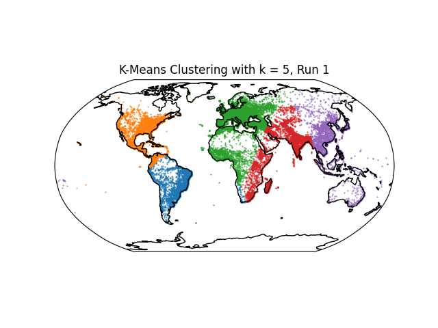 <br/>
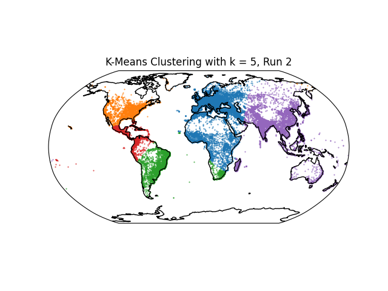 <br/>
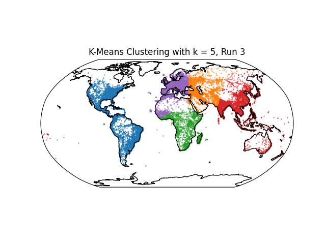 <br/>

K-means clustering runs with k = 7: <br/>
When k = 7, there's little diversity. Runs 1 and 2 look the same, but run 3 has some variation in the Eastern hemisphere, particularly in Africa and Asia. This small amount of diversity is probably due to the number of clusters matching the number of continents, but small variation may happen due to the initial centers being randomly sampled. <br/>
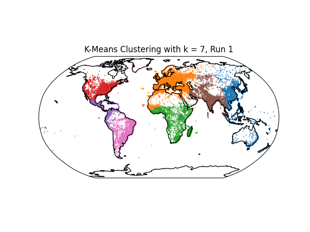 <br/>
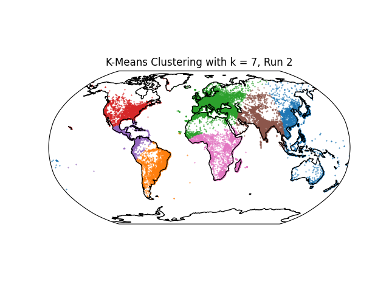 <br/>
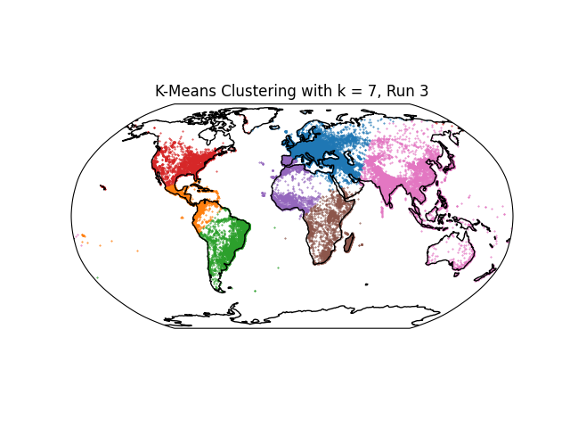 <br/>

K-means clustering runs with k = 15: <br/>
When k = 15, there is a good amount of diversity. There are different amounts of clusters per hemisphere, and the location and borders of these clusters are also different between plots. This is probably due to the amount of clusters getting large, so there can be a lot more variation for these clusters because of how densely cities are located and the fact that the initial centers are randomly sampled. <br/>
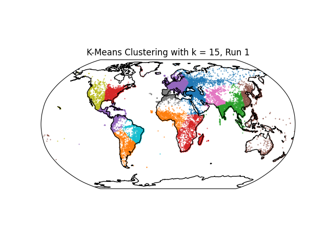 <br/>
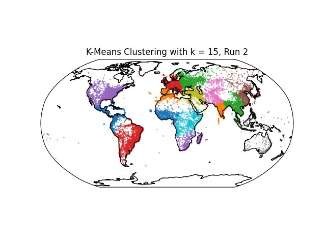 <br/>
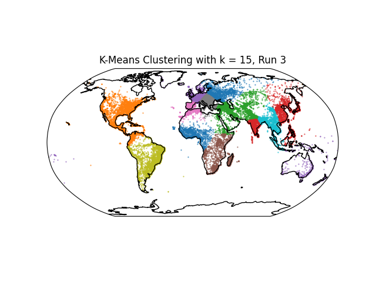 <br/>

# Exercise 3
## Instructions
Running the script will output the plot of number of infected individuals over time when beta = 2 and gamma = 1. The date of the peak infected number of people and the peak number of infected people will then be printed out to the terminal. Following this, the heat map for time of the peak infection will popup. After closing the heat map, the heat map for number of individuals infected at peak will show up.
## Exercise 3 Questions
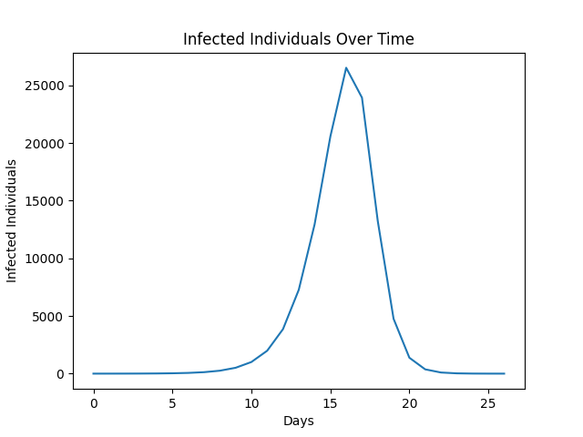 <br/>
The number of infected people peak on day 16, and 26534 (code returned 26533.15263086103, but I rounded up because you can't have a part of a person) people are infected at peak when given parameters N = 137,000, I(0) = 1, beta = 2, and gamma = 1. <br/>
When varying beta and gamma, I chose to choose 20 values for each. For beta, I took the values from a range of 1 to 3, and for gamma, I took the values from a range of 0.1 to 2. The following two heat maps are the results. <br/>
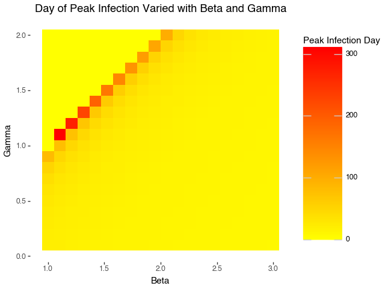 <br/>
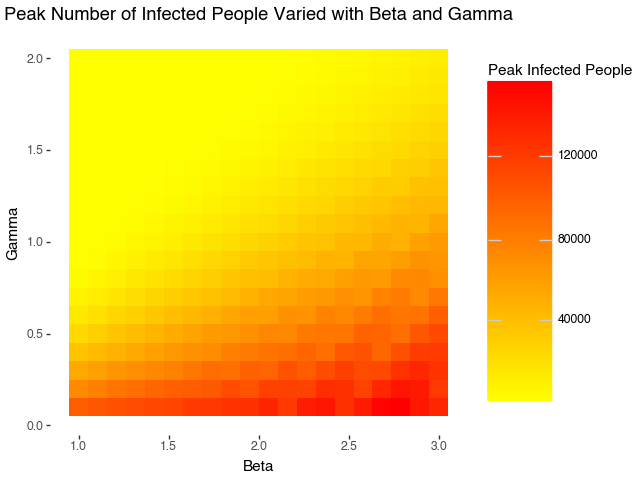 <br/>

# Exercise 4
## Instructions
Running the script will output some text in terminal, of which one line should read "Running on http://" with a link for the http://. After opening this link, input the column name that you would like the mean and standard deviation of. Some of the column names are listed on the page, but if you would like to explore other columns, please open Chronic_Kidney_Dsease_data.csv and look at the column names. Once you press analyze, the page will update and show what you column name you put in and the mean and standard deviation of said column.
## Exercise 4 Questions
The server.py file serves as a sort of navigator between html files, transferring information that is submitted and is able to analyze user input. The index.html file is the first page the user sees, and there's a text box that can be written in. When the analyze button is pressed, the user input goes back to server.py where it is analyzed. Once done, server.py sends the user input and analyzed data to index.html, which displays both pieces of information. <br/>
There are a few key parts of the files. In the server.py file, we have app = Flask(__name__) which makes the server able to handle requests. There is also @app.route(), which allows for navigation between different htmls. render_template() is also important, as it is what's used to make the HTML show up to the user and have the proper data sent over to the HTML. <br/>
https://www.kaggle.com/datasets/rabieelkharoua/chronic-kidney-disease-dataset-analysis <br/>
The dataset above is about patients diagnosed with chronic kidney disease (CKD). It contains a variety of different features that may impact CKD, ranging from past medical history to socioeconomic factors. <br/>
I found the dataset on kaggle by filtering health with the healthcare tag and making sure there was a Creative Commons license.
The license for this dataset is CC BY 4.0. This is the same dataset I found in problem set 1. <br/>
For my question, I had the user input a column name in my dataset that they wanted the mean and standard deviation of. The output would return the calculated mean and standard deviation. The response was calculated from the dataset that was in the form of a csv file, and it was done using .mean() and .std() on the column name provided by the user. <br/>
The following images are my site's inputs and outputs for BMI and PhysicalActivity, as I wanted to show that Python is working with the relevant data in the dataset. <br/>
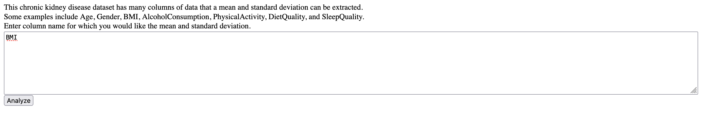 <br/>
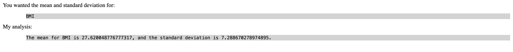 <br/>
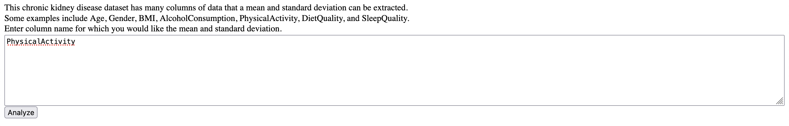 <br/>
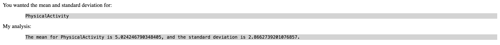 <br/>

# Appendix
## Exercise 1
```python
import requests
from tqdm import tqdm

def get_error(a, b):
    return float(requests.get(f"http://ramcdougal.com/cgi-bin/error_function.py?a={a}&b={b}", headers={"User-Agent": "MyScript"}).text)

def gradient_estimate(a, b, delta):
    error = get_error(a, b)

    error_delta_a = get_error(a + delta, b)
    gradient_a = (error_delta_a - error)/delta

    error_delta_b = get_error(a, b + delta)
    gradient_b = (error_delta_b - error)/delta

    return gradient_a, gradient_b

def gradient_descent(start_a, start_b, alpha, tolerance, iterations):
    a = start_a
    b = start_b
    current_error = 1
    new_error = 0
    for i in tqdm(range(iterations), desc = "Gradient Descent"):
        current_error = get_error(a, b)
        gradient_a, gradient_b = gradient_estimate(a, b, 0.00001)
        new_a = a - alpha*gradient_a
        new_a = min(max(new_a, 0), 1)
        new_b = b - alpha*gradient_b
        new_b = min(max(new_b, 0), 1)

        new_error = get_error(new_a, new_b)
        if abs(current_error - new_error) < tolerance:
            print("Error converged within tolerance")
            return new_a, new_b, new_error
        
        a = new_a
        b = new_b
    print("Reached max number of iterations")
    return a, b, new_error

start_points = [(0.1, 0.1), (0.5, 0.5), (0.9, 0.9), (0.1, 0.9), (0.9, 0.1), (0.2, 0.6), (0.7, 0.2)]
results = []
for start_a, start_b in tqdm(start_points, desc = "Start Points"):
    final_a, final_b, error = gradient_descent(start_a, start_b, 0.1, 0.0001, 20)
    results.append((final_a, final_b, error))

for result in results:
    print(result)
```

## Exercise 2
```python
import numpy as np
import cartopy.crs as ccrs
import matplotlib.pyplot as plt
import pandas as pd
import random

def lat_lon_to_cartesian(lat, lon):
    """Convert latitude and longitude to Cartesian coordinates."""
    lat_rad = np.radians(lat)
    lon_rad = np.radians(lon)
    x = np.cos(lat_rad) * np.cos(lon_rad)
    y = np.cos(lat_rad) * np.sin(lon_rad)
    z = np.sin(lat_rad)
    return np.array([x, y, z])


def cartesian_to_lat_lon(cartesian_coords):
    """Convert Cartesian coordinates to latitude and longitude."""
    x, y, z = cartesian_coords
    lon = np.arctan2(y, x)
    hyp = np.sqrt(x**2 + y**2)
    lat = np.arctan2(z, hyp)
    return np.degrees(lat), np.degrees(lon)

def cosine_similarity(vec1, vec2):
    """Calculate cosine similarity between two vectors."""
    return np.dot(vec1, vec2) / (np.linalg.norm(vec1) * np.linalg.norm(vec2))

df = pd.read_csv("problem_set_3/worldcities.csv")
city_data = df[['lat','lng']].copy()
city_data['cartesian'] = city_data.apply(lambda row: lat_lon_to_cartesian(row['lat'], row['lng']), axis = 1)
pts = city_data['cartesian'].tolist()

def k_means(k):
    centers = random.sample(pts, k)
    old_cluster_ids, cluster_ids = None, []
    while cluster_ids != old_cluster_ids:
        old_cluster_ids = list(cluster_ids)
        cluster_ids = []
        for pt in pts:
            closest_cluster = -1
            max_similarity = -1
            for i, center in enumerate(centers):
                similarity = cosine_similarity(pt, center)
                if similarity > max_similarity:
                    closest_cluster = i
                    max_similarity = similarity
            cluster_ids.append(closest_cluster)
        city_data['cluster'] = cluster_ids
        cluster_pts = [[pt for pt, cluster in zip(pts, cluster_ids) if cluster == match] for match in range(k)]
        centers = [np.mean(pts, axis = 0)/np.linalg.norm(np.mean(pts, axis = 0)) for pts in cluster_pts]
    return centers

def plot(city_data, k, run):
    fig, ax = plt.subplots(subplot_kw={"projection": ccrs.Robinson()})
    ax.set_global()
    ax.coastlines()

    # Plot each cluster in a different color
    for i in range(k):
        cluster_points = city_data[city_data['cluster'] == i]
        lons = cluster_points['lng']
        lats = cluster_points['lat']
        ax.scatter(
            lons, lats, s=0.2, transform=ccrs.PlateCarree(), label=f"Cluster {i+1}"
        )
    plt.title(f"K-Means Clustering with k = {k}, Run {run}")
    plt.show()

k_means(5)
plot(city_data, 5, 1)
k_means(5)
plot(city_data, 5, 2)
k_means(5)
plot(city_data, 5, 3)
k_means(7)
plot(city_data, 7, 1)
k_means(7)
plot(city_data, 7, 2)
k_means(7)
plot(city_data, 7, 3)
k_means(15)
plot(city_data, 15, 1)
k_means(15)
plot(city_data, 15, 2)
k_means(15)
plot(city_data, 15, 3)
```

## Exercise 3
```python
import numpy as np
import matplotlib.pyplot as plt
import pandas as pd
import plotnine as p9

def SIR_model(S0, I0, R0, beta, gamma, t_max):
    N = S0 + I0 + R0
    dt = 1
    t = np.arange(0, t_max + dt, dt)
    S = np.zeros(t_max + 1)
    I = np.zeros(t_max + 1)
    R = np.zeros(t_max + 1)
    S[0] = S0
    I[0] = I0
    R[0] = R0

    for i in range(1, t_max + 1):
        dS_dt = -beta * S[i-1] * I[i-1] / N
        dI_dt = beta * S[i-1] * I[i-1] / N - gamma * I[i-1]
        dR_dt = gamma * I[i-1]
        S[i] = S[i-1] + dS_dt * dt
        I[i] = I[i-1] + dI_dt * dt
        R[i] = R[i-1] + dR_dt * dt
        if I[i] < 1:
            return t[:i+1], S[:i+1], I[:i+1], R[:i+1]
    return t, S, I, R

def plot_time_vs_infected(t, I):
    plt.plot(t, I)
    plt.xlabel("Days")
    plt.ylabel("Infected Individuals")
    plt.title("Infected Individuals Over Time")
    plt.show()

def peak_infection(I):
    peak_infected = max(I)
    peak_time = np.argmax(I)
    return peak_infected, peak_time

t1, S1, I1, R1 = SIR_model(S0 = 136999, I0 = 1, R0 = 0, beta = 2, gamma = 1, t_max = 365)
plot_time_vs_infected(t1, I1)
peak_infected_1, peak_time_1 = peak_infection(I1)
print("The number of infected people reached its peak on day " + str(peak_time_1) + ", with the number being " + str(peak_infected_1))

beta_values = np.linspace(1, 3, 20)
gamma_values = np.linspace(0.1, 2, 20)
results = []

for beta in beta_values:
    for gamma in gamma_values:
        t, S, I, R = SIR_model(136999, 1, 0, beta, gamma, 365)
        peak_infected, peak_time = peak_infection(I)
        results.append({
            'beta': beta,
            'gamma': gamma,
            'peak_infected': peak_infected,
            'peak_time': peak_time
        })

infection_data = pd.DataFrame(results)

heatmap_time = p9.ggplot(data = infection_data, mapping = p9.aes(x = 'beta', y = 'gamma', fill = 'peak_time'))
heatmap_time += p9.geom_tile()
heatmap_time += p9.ggtitle("Day of Peak Infection Varied with Beta and Gamma")
heatmap_time += p9.theme(panel_background = p9.element_rect(fill = "white"))
heatmap_time += p9.labs(x = 'Beta', y = 'Gamma', fill = 'Peak Infection Day')
heatmap_time += p9.scale_fill_gradient(low = "yellow", high = "red")
heatmap_time.show()

heatmap_infected = p9.ggplot(data = infection_data, mapping = p9.aes(x = 'beta', y = 'gamma', fill = 'peak_infected'))
heatmap_infected += p9.geom_tile()
heatmap_infected += p9.ggtitle("Peak Number of Infected People Varied with Beta and Gamma")
heatmap_infected += p9.theme(panel_background = p9.element_rect(fill = "white"))
heatmap_infected += p9.labs(x = 'Beta', y = 'Gamma', fill = 'Peak Infected People')
heatmap_infected += p9.scale_fill_gradient(low = "yellow", high = "red")
heatmap_infected.show()
```

## Exercise 4
### Exercise4.py
```python
from flask import Flask, render_template, request
import pandas as pd

app = Flask(__name__)

df = pd.read_csv("problem_set_3/Chronic_Kidney_Dsease_data.csv")

@app.route("/")
def index():
    return render_template("index.html")

@app.route("/analyze", methods = ["POST"])
def analyze():
    column_name = request.form["column_name"]
    column_data = df[column_name]
    mean = column_data.mean()
    std = column_data.std()
    result = "The mean for " + column_name + " is " + str(mean) + ", and the standard deviation is " + str(std) + "."
    return render_template("analyze.html", analysis = result, column_name = column_name)

if __name__ == "__main__":
    app.run(debug = True)
```

### index.html
```html
<html>
    <body>
        This chronic kidney disease dataset has many columns of data that a mean and standard deviation can be extracted. <br>
        Some examples include Age, Gender, BMI, AlcoholConsumption, PhysicalActivity, DietQuality, and SleepQuality. <br>
        Enter column name for which you would like the mean and standard deviation.
        <form action = "/analyze" method = "POST">
            <textarea style = "width:100%; height: 10em" name = "column_name"></textarea>
            <br>
            <input type = "submit" value = "Analyze">
        </form>
    </body>
</html>
```

### analyze.html
```html
<html>
    <body>
        You wanted the mean and standard deviation for:
        <pre style = "background-color: lightgray; margin-left: 5em">{{column_name}}</pre>
        My analysis:
        <pre style = "background-color: lightgray; margin-left: 5em">{{analysis}}</pre>
    </body>
</html>
```