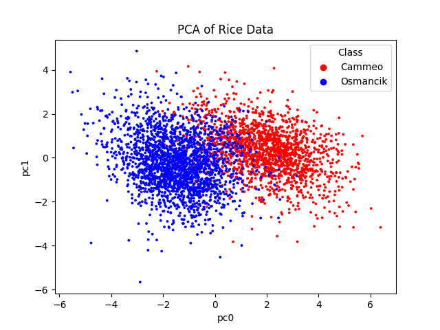
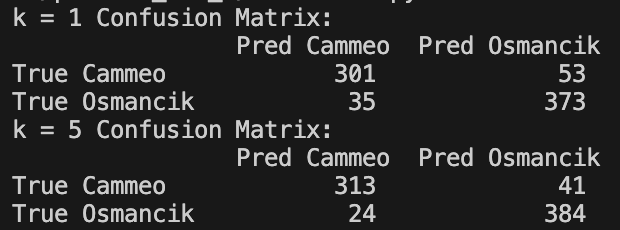
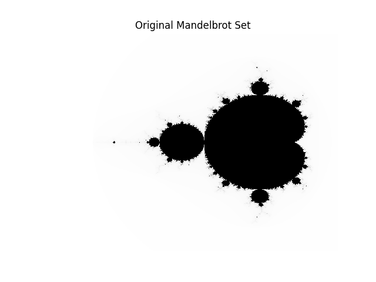
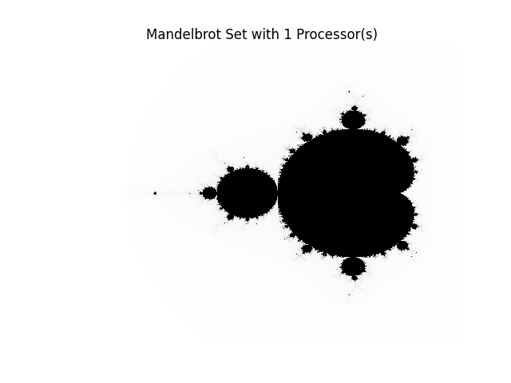

# Skills Demonstrated:
## Classic algorithm implementation from scratch
Implemented the Smith-Waterman local sequence alignment algorithm (dynamic programming with a traceback step), a foundational technique in computational biology/bioinformatics, without relying on an existing library.
## Custom data structures
Designed and built a quad-tree from scratch to support efficient 2D spatial nearest-neighbor queries, rather than a brute-force distance scan.
## Applied machine learning fundamentals
Performed feature standardization, PCA-based dimensionality reduction, an appropriate train/test split, and a from-scratch k-nearest-neighbors classifier (rather than calling sklearn's KNN).
## Model evaluation and interpretation
Built and read confusion matrices to evaluate classifier performance at different values of k, and reasoned about what the results imply about class separability.
## Parallel/high-performance computing
Parallelized a compute-heavy fractal-generation algorithm with MPI (mpi4py), including manual work partitioning across processes, collective communication (Allgather), and benchmarking to quantify real speedup.
## Scientific computing tooling
Used NumPy for numerical computation and Matplotlib for visualization (scatterplots and image rendering).
## Validation
Designed multiple test cases with varied parameters to check correctness of custom implementations, and cross-validated outputs (e.g., confirming the parallel Mandelbrot output matches the serial version) before trusting performance results.

# Exercise 1
## Instructions
When running this code, it will print out seq1, seq2, and the score for each test in the terminal. Each test has a loading bar associated with it and the description of the test shows up before seq1, seq2, and the score.
## Exercise 1 Questions
The first test has seq1 = tgcatcgagaccctacgtgac and seq2 = actagacctagcatcgac. match = gap_penalty = mismatch_penalty = 1. This test returns seq1 = agacccta-cgt-gac and seq2 = aga-cctagcatcgac with score = 8. This shows that the function works as the example does, which is a good sign. <br/>
The second test is the same as the first, except gap_penalty = 2. This test returns seq1 = seq2 = gcatcga with score = 7. This is the same result as the example, and it shows that adjusting the gap_penalty value reflects the appropriate changes when running the function. <br/>
The third test is the same as the first, except mismatch_penalty = -1. This test returns seq1 = tgcatcgagaccctacgt and seq2 = actagacctagcatcgac with score = 18. This result checks out, as a mismatch is calculated as a match, so the aligned sequences will return the original sequence, cutting off at the shorter sequence's length. The score would also be the same as the length of the shorter sequence. This test shows that changes in mismatch_penalty act properly on the function.<br/>
The fourth test is the same as the first, except match = 2. This test returns seq1 = atcgagacccta-cgt-gac and seq2 = a-ctaga-cctagcatcgac with score = 22. To validate this test, I looked at the first test. The first test has 12 matches, but the 3 gaps and 1 mismatch brings the score down to 8. The fourth test would double the score from the matches, making the score = 20. The fourth test also aligns 2 more matches, 1 more mismatch, and 1 more gap, which adds 2 to the score, resulting in score = 22. This test shows that changes in match alters the function correctly.

# Exercise 2
## Instructions
When running this code, the PCA scatterplot will first appear. Once the PCA scatterplot is closed, the confusion matrices for k = 1 and k = 5 will be printed to the terminal, with labels for the rows and columns.
## Exercise 2 Questions
 <br/>
When looking at the above scatterplot, we see that the Cammeo and Osmancik rice are have some overlap in the middle, but Osmancik rice are generally to the left while Cammeo rice are generally to the right. With this distribution, I would say that knn would be reasonably effective on this 2-dimensional reduction of rice data, as there wouldn't be many points where a sufficiently high k nearest neighbors would give the wrong label. <br/>
I chose to do an 80:20 train-test split, since that seemed like an appropriate amount based on a quick google search. <br/>
Confusion Matrices: <br/>
 <br/>
The confusion matrices printed out are very similar for k=1 and k=5. The matrices show that the knn is able to accurately predict the rice type a good amount of the time. These matrix results indicate that the data has relatively clear boundaries between rice types, as it is able to make good predictions and an increase in k doesn't lead to a significant change in performance. The nearest neighbor making a similar prediction to multiple nearest neighbors indicates defined boundaries.

# Exercise 3
## Instructions
For mandelbrot_set.py, running the code will print the time it took to calculate the image and display the mandelbrot set. <br/>
For Exercise3.py, I ran the following lines for 1, 2, and 4 processors respectively: <br/>
    mpiexec -n 1 python3 problem_set_4/Exercise3.py <br/>
    mpiexec -n 2 python3 problem_set_4/Exercise3.py <br/>
    mpiexec -n 4 python3 problem_set_4/Exercise3.py <br/>
Each of the above Exercise3.py lines will print the time it took to calculate the image and display the mandelbrot set. <br/>
## Exercise 3 Questions
 <br/>
 <br/>
 <br/>
 <br/>
The above images are all the same, showing that my parallel version of mandelbrot_set.py generates the same results as the original. <br/>
The following times are the calculations of the original mandelbrot code and the parallel version with varying number of processes: <br/>
mandelbrot_set.py: Calculation took 16.101782682992052 seconds <br/>
    Exercise3.py with 1 processor: Calculation took 18.736789661 seconds <br/>
    Exercise3.py with 2 processors: Calculation took 9.548090132 seconds <br/>
    Exercise3.py with 4 processors: Calculation took 9.957609466 seconds <br/>
Looking at these timings, I would say that my parallel version runs meaningfully faster than the original when there is more than 1 processor. <br/>
To parallelize the program, I made changes to calculate_set() and if \__name__ == "\__main__". For calculate_set(), I changed its parameters to include a start and end row, as each processor would only calculate some of the rows. I changed result to only include the rows the processor is dealt with. I also adjusted the for loop to iterate for the number of rows the processor was assigned and changed y = i * dy + ylo to y = (start_row + i) * dy + ylo to calculate the rows for the specific processor. <br/>
For if \__name__ == "\__main__", I created my processors and evenly distributed the rows to each processor. I then changed the call to calculate_set() to include start_row and end_row parameters. I then created an empty array called mandelbrot_set and used Allgather to fill mandelbrot_set with the calculated rows from all the processors. Lastly, I added a title to the plot to show how many processors were used to create the image. <br/>
The main limitation to my approach would be unbalanced work and overhead. Unbalanced work may be an issue because I split the work by rows, but some points are easier to calculate than others, so some processes may finish earlier than others, leading to some processes waiting on others. Overhead is an issue, and this is seen when comparing 1 processor to the original mandelbrot_set.py and comparing 2 processors to 4 processors.

# Appendix
## Exercise 1
```python
from tqdm import tqdm

def align(seq1, seq2, match = 1, gap_penalty = 1, mismatch_penalty = 1):
    rows = len(seq1) + 1
    cols = len(seq2) + 1
    score_matrix = [[0] * cols for _ in range(rows)]
    traceback_matrix = [[None] * cols for _ in range(rows)]
    max_score = 0
    max_pos = None
    for i in tqdm(range(1, rows)):
        for j in range(1, cols):
            if seq1[i-1] == seq2[j-1]:
                match_score = match
            else:
                match_score = -mismatch_penalty

            diag_score = score_matrix[i-1][j-1] + match_score
            up_score = score_matrix[i-1][j] - gap_penalty
            left_score = score_matrix[i][j-1] - gap_penalty
            score_matrix[i][j] = max(diag_score, up_score, left_score, 0)

            if score_matrix[i][j] == diag_score:
                traceback_matrix[i][j] = "diag"
            elif score_matrix[i][j] == up_score:
                traceback_matrix[i][j] = "up"
            elif score_matrix[i][j] == left_score:
                traceback_matrix[i][j] = "left"
            
            if score_matrix[i][j] > max_score:
                max_score = score_matrix[i][j]
                max_pos = (i,j)

    seq1_aligned = ""
    seq2_aligned = ""
    i, j = max_pos

    while score_matrix[i][j] != 0:
        if traceback_matrix[i][j] == "diag":
            seq1_aligned = seq1[i-1] + seq1_aligned
            seq2_aligned = seq2[j-1] + seq2_aligned
            i -= 1
            j -= 1
        elif traceback_matrix[i][j] == "up":
            seq1_aligned = seq1[i-1] + seq1_aligned
            seq2_aligned = "-" + seq2_aligned
            i -= 1
        elif traceback_matrix[i][j] == "left":
            seq1_aligned = "-" + seq1_aligned
            seq2_aligned = seq2[j-1] + seq2_aligned
            j -= 1

    return seq1_aligned, seq2_aligned, max_score

seq1 = 'tgcatcgagaccctacgtgac'
seq2 = 'actagacctagcatcgac'
seq1_aligned, seq2_aligned, max_score = align(seq1, seq2)
print("Default test taken from example")
print(f"seq1 = {seq1_aligned}")
print(f"seq2 = {seq2_aligned}")
print(f"Score = {max_score}")

seq1_aligned, seq2_aligned, max_score = align(seq1, seq2, gap_penalty = 2)
print("Test with gap penalty = 2 taken from example")
print(f"seq1 = {seq1_aligned}")
print(f"seq2 = {seq2_aligned}")
print(f"Score = {max_score}")

seq1_aligned, seq2_aligned, max_score = align(seq1, seq2, mismatch_penalty = -1)
print("Test with mismatch penalty = -1")
print(f"seq1 = {seq1_aligned}")
print(f"seq2 = {seq2_aligned}")
print(f"Score = {max_score}")

seq1_aligned, seq2_aligned, max_score = align(seq1, seq2, match = 2)
print("Test with match = 2")
print(f"seq1 = {seq1_aligned}")
print(f"seq2 = {seq2_aligned}")
print(f"Score = {max_score}")
```
## Exercise 2
```python
import pandas as pd
from sklearn import decomposition, preprocessing
from collections import Counter
import matplotlib.pyplot as plt
from sklearn.model_selection import train_test_split
from sklearn.metrics import confusion_matrix

data = pd.read_excel('problem_set_4/Rice_Cammeo_Osmancik.xlsx')

scaler = preprocessing.StandardScaler()
my_cols = ['Area', 'Perimeter', 'Major_Axis_Length', 'Minor_Axis_Length', 'Eccentricity', 'Convex_Area', 'Extent']
data_scaled = scaler.fit_transform(data[my_cols])

pca = decomposition.PCA(n_components=2)
data_reduced = pca.fit_transform(data_scaled)
pc0 = data_reduced[:, 0]
pc1 = data_reduced[:, 1]

color_mapping = {'Cammeo': 'red', 'Osmancik': 'blue'}
data['Class_Color'] = data['Class'].map(color_mapping)
plt.scatter(pc0, pc1, c = data['Class_Color'], s = 3)
plt.xlabel('pc0')
plt.ylabel('pc1')
plt.title('PCA of Rice Data')
for label, color in color_mapping.items():
    plt.scatter([], [], c=color, label=label)
plt.legend(title='Class')
plt.show()

class QuadTree:
    def __init__(self, xlo, ylo, xhi, yhi, points, max_points = 4):
        self.bounds = (xlo, ylo, xhi, yhi)
        self.points = points
        self.children = []
        self.max_points = max_points

        if len(points) > max_points:
            self.subdivide()

    def subdivide(self):
        xlo, ylo, xhi, yhi = self.bounds
        xmid = (xlo + xhi) / 2
        ymid = (ylo + yhi) / 2
        quadrants = [[],[],[],[]]
        for px, py, label in self.points:
            if px <= xmid and py <= ymid:
                quadrants[0].append((px, py, label))
            elif px > xmid and py <= ymid:
                quadrants[1].append((px, py, label))
            elif px <= xmid and py > ymid:
                quadrants[2].append((px, py, label))
            else:
                quadrants[3].append((px, py, label))

        self.children = [
            QuadTree(xlo, ylo, xmid, ymid, quadrants[0], self.max_points),
            QuadTree(xmid, ylo, xhi, ymid, quadrants[1], self.max_points),
            QuadTree(xlo, ymid, xmid, yhi, quadrants[2], self.max_points),
            QuadTree(xmid, ymid, xhi, yhi, quadrants[1], self.max_points)
        ]

        self.points = None
    
    def contains(self, x, y):
        xlo, ylo, xhi, yhi = self.bounds
        return (xlo <= x <= xhi and ylo <= y <= yhi)
    
    def small_containing_quadtree(self, x, y):
        if not self.contains(x,y) or not self.children:
            return self
        for child in self.children:
            if child.contains(x,y):
                return child.small_containing_quadtree(x,y)
            
    def _within_distance(self, x, y, d):
        xlo, ylo, xhi, yhi = self.bounds
        closest_x_in_bounds = min(max(x, xlo), xhi)
        closest_y_in_bounds = min(max(y, ylo), yhi)
        return (closest_x_in_bounds - x)**2 + (closest_y_in_bounds - y)**2 <= d**2
    
    def leaves_within_distance(self, x, y, d):
        if not self._within_distance(x, y, d):
            return []
        if self.children:
            neighbor_quadtrees = []
            for child in self.children:
                neighbor_quadtrees.extend(child.leaves_within_distance(x, y, d))
            return neighbor_quadtrees
        else:
            return [(px, py, label) for px, py, label in self.points if (px - x)**2 + (py - y)**2 <= d**2]
        
    def query(self, x, y, k):
        init_tree = self.small_containing_quadtree(x, y)
        neighbors = init_tree.points
        radius = 0.1
        while len(neighbors) < k:
            neighbors = self.leaves_within_distance(x, y, radius)
            radius *= 2
        neighbors = sorted(neighbors, key = lambda p: ((p[0] - x)**2 + (p[1] - y) **2))[:k]
        return neighbors

def knn(quad_tree, x, y, k):
    neighbors = quad_tree.query(x, y, k)
    labels = [label for _, _, label in neighbors]
    label_counts = Counter(labels)
    most_common_label = label_counts.most_common(1)[0][0]
    return most_common_label

train_data, test_data = train_test_split(data, test_size = 0.2, random_state = 1)
train_data_scaled = scaler.fit_transform(train_data[my_cols])
test_data_scaled = scaler.transform(test_data[my_cols])
train_data_reduced = pca.fit_transform(train_data_scaled)
test_data_reduced = pca.transform(test_data_scaled)
train_data['pc0'] = train_data_reduced[:,0]
train_data['pc1'] = train_data_reduced[:,1]
test_data['pc0'] = test_data_reduced[:,0]
test_data['pc1'] = test_data_reduced[:,1]

train_points = list(zip(train_data['pc0'], train_data['pc1'], train_data['Class']))
xlo, ylo = train_data[['pc0', 'pc1']].min()
xhi, yhi = train_data[['pc0', 'pc1']].max()
quad_tree = QuadTree(xlo, ylo, xhi, yhi, train_points)

def knn_test(test_data, quad_tree, k):
    predictions = []
    for _, row in test_data.iterrows():
        prediction = knn(quad_tree, row['pc0'], row['pc1'], k)
        predictions.append(prediction)
    correct_labels = test_data['Class']
    cm = confusion_matrix(correct_labels,predictions, labels = ['Cammeo', 'Osmancik'])
    df_cm = pd.DataFrame(
        cm,
        index = ['True Cammeo', 'True Osmancik'],
        columns = ['Pred Cammeo', 'Pred Osmancik']
    )
    return df_cm

cm_k1 = knn_test(test_data, quad_tree, k=1)
print("k = 1 Confusion Matrix:\n", cm_k1)

cm_k5 = knn_test(test_data, quad_tree, k=5)
print("k = 5 Confusion Matrix:\n", cm_k5)
```
## Exercise 3
```python
import matplotlib.pyplot as plt
import numpy
import time
from mpi4py import MPI

xlo = -2.5
ylo = -1.5
yhi = 1.5
xhi = 0.75
nx = 2048
ny = 1536
dx = (xhi - xlo) / nx
dy = (yhi - ylo) / ny

iter_limit = 200
set_threshold = 2

def mandelbrot_test(x, y):
    z = 0
    c = x + y * 1j
    for i in range(iter_limit):
        z = z ** 2 + c
        if abs(z) > set_threshold:
            return i
    return i

def calculate_set(start_row, end_row):
    rows = end_row - start_row
    result = numpy.zeros([rows, nx])
    for i in range(rows):
        y = (start_row + i) * dy + ylo
        for j in range(nx):
            x = j * dx + xlo
            result[i, j] = mandelbrot_test(x, y)
    return result

if __name__ == "__main__":
    communicator = MPI.COMM_WORLD
    rank = communicator.rank
    processors = communicator.size

    rows_per_processor = ny // processors
    start_row = rank*rows_per_processor
    if rank == processors - 1:
        end_row = ny
    else:
        end_row = start_row + rows_per_processor
    
    start_time = time.perf_counter()
    
    processor_result = calculate_set(start_row, end_row)
    mandelbrot_set = numpy.zeros([ny,nx])
    communicator.Allgather(processor_result, mandelbrot_set)

    stop_time = time.perf_counter()

    if(rank == 0):
        print(f"Calculation took {stop_time - start_time} seconds")
        plt.imshow(mandelbrot_set, interpolation="nearest", cmap="Greys")
        plt.gca().set_aspect("equal")
        plt.axis("off")
        plt.title(f"Mandelbrot Set with {processors} Processor(s)")
        plt.show()
```